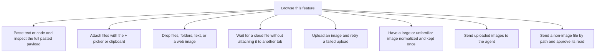

# Attachments and content

Files, images and pasted text enter through different paths. Native non-image files send a local path. Images upload bytes. Pasted text becomes part of the message.

Each gesture stays tied to its original conversation. Preview, upload, send and cleanup are separate steps. Reopened history may show references instead of the original local previews.

## Feature overview

These boxes open related pages. They are parts of the system, rather than mutually exclusive runtime states.

## Browse flows

- [Attach files with the + picker or clipboard](attach-files-with-the-picker-or-clipboard.md)
- [Drop files, folders, text, or a web image](drop-files-folders-text-or-a-web-image.md)
- [Have a large or unfamiliar image normalized and kept once](have-a-large-or-unfamiliar-image-normalized-and-kept-once.md)
- [Open a link without replacing the app](open-a-link-without-replacing-the-app.md)
- [Paste text or code and inspect the full pasted payload](paste-text-or-code-and-inspect-the-full-pasted-payload.md)
- [Preview or remove a draft attachment](preview-or-remove-a-draft-attachment.md)
- [Read rich text, code, math, and diagrams in a message](read-rich-text-code-math-and-diagrams-in-a-message.md)
- [Reopen a message and understand its reference-only attachments](reopen-a-message-and-understand-its-reference-only-attachments.md)
- [Send a non-image file by path and approve its read](send-a-non-image-file-by-path-and-approve-its-read.md)
- [Send uploaded images to the agent](send-uploaded-images-to-the-agent.md)
- [Stop or delete a conversation and release its uploaded images](stop-or-delete-a-conversation-and-release-its-uploaded-images.md)
- [Understand an attachment refusal and choose a useful recovery](understand-an-attachment-refusal-and-choose-a-useful-recovery.md)
- [Upload an image and retry a failed upload](upload-an-image-and-retry-a-failed-upload.md)
- [Wait for a cloud file without attaching it to another tab](wait-for-a-cloud-file-without-attaching-it-to-another-tab.md)

## R2/R4 regression execution

Historical controlled regressions reproduced a silent second URL drop and a send during a pending native image read. The fixes retain the first read, refuse the second gesture and block the affected draft until its read settles. See [the risk register](../../../risks.md) for the executed cases, negative controls and environment limits.
