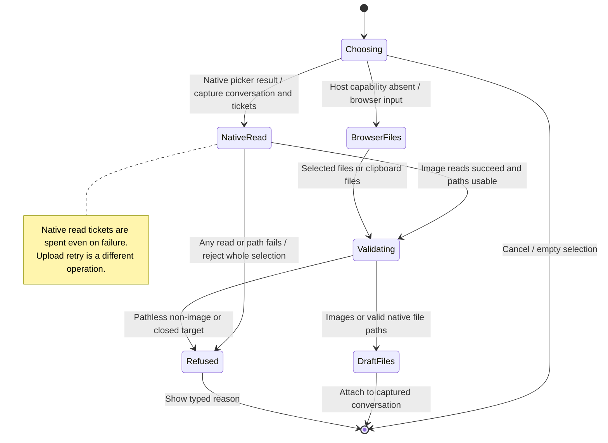

# Attach files with the + picker or clipboard

The + picker captures which conversation will receive the files before it opens. Native non-image files become local-path references. Image bytes are read and passed to the upload flow. Cancellation adds nothing; a failed image read refuses the selection rather than silently adding only some files.

Browser and clipboard files have no absolute local path. Images can upload, but those non-image files cannot use the native path-reference contract. Native read tickets are single-use even when the read fails; choosing again creates a new one.

## Further reading

[Source](../../../../../src/panel/ui/use-file-attachments.ts) · [Related source](../../../../../src/host/window.ts) · [Related tests](../../../../../src/panel/ui/use-file-attachments-picker.test.ts)
