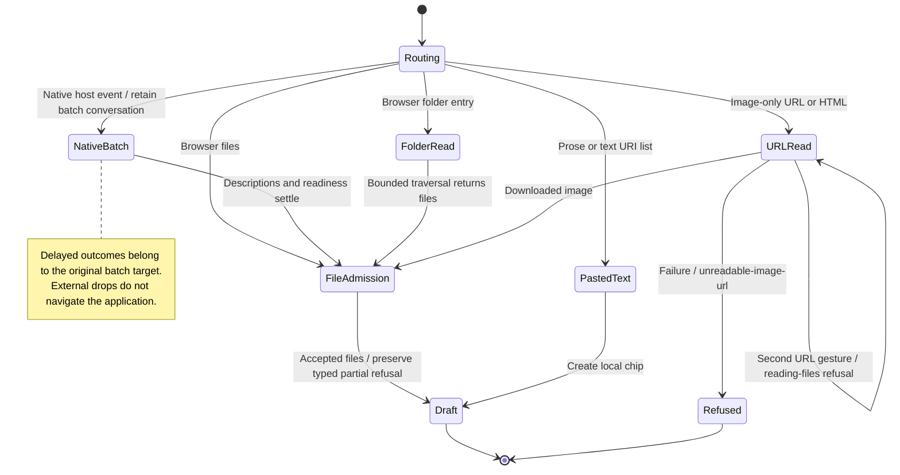

# Drop files, folders, text, or a web image

Dropping content keeps it tied to the conversation that received the gesture. Native drops use the host's file paths; browser drops use browser files. Folder handling collects files within its limits.

An image-only web drop is downloaded as an image. Prose with an inline image stays text. Other text and link lists become pasted-text chips. A second image-URL drop is refused while the first read is pending. A download failure can have several causes, so its notice does not identify the failing network check by itself.

## Further reading

[Source](../../../../../src-tauri/src/attachments/dropping.rs) · [Related source](../../../../../src-tauri/src/attachments/dragged.rs) · [Related tests](../../../../../src/panel/ui/use-host-drop.test.ts)
