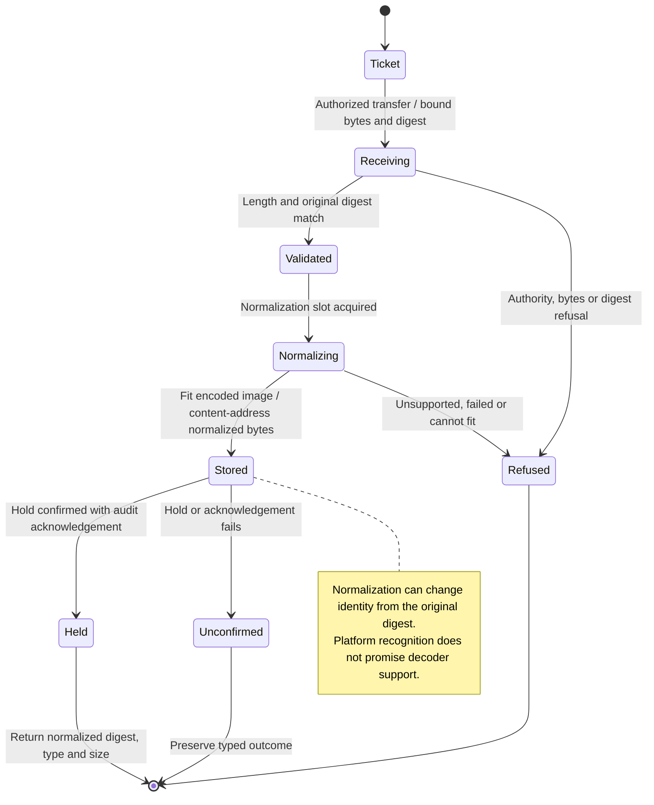

# Have a large or unfamiliar image normalized and kept once

The gateway checks an image's actual bytes, turns it upright and fits it to the agent's supported size and format. The panel keeps the original preview, so what you see can differ from the resized image delivered to the agent.

A supported image may pass through after validation. Others become PNG or JPEG, or are refused when they cannot fit. Format support can differ by operating system. Repeating the same upload can recover its stored reference, but stored bytes alone do not grant a conversation permission to send them.

## Further reading

[Source](../../../../../crates/nessa-server/src/attachments/infrastructure/normalizer.rs) · [Related source](../../../../../crates/nessa-server/src/composition/attachments.rs) · [Related tests](../../../../../crates/nessa-images/tests/normalize.rs)
