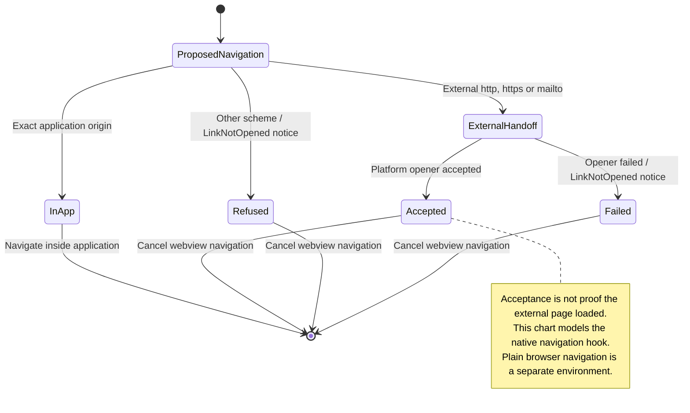

# Open a link without replacing the app

In a native Nessa window, external web and mail links are handed to the system opener. App-owned addresses stay inside Nessa; unsupported schemes are refused. A failed handoff shows a dismissible notice in the panel.

An accepted handoff does not prove the destination loaded. Some new-window, download and platform navigation paths fall outside this hook. Plain browsers have different navigation behavior, and another native surface needs its own notice subscription.

## Further reading

[Source](../../../../../src-tauri/src/links.rs) · [Related source](../../../../../src-tauri/src/platform/mod.rs) · [Related tests](../../../../../src/panel/application/link-notice.test.ts)
