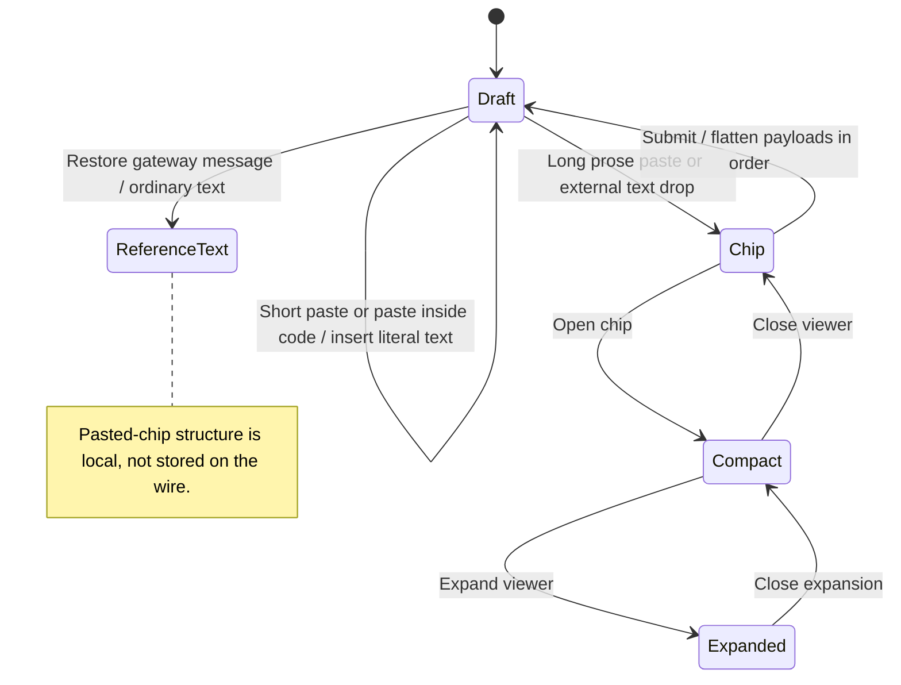

# Paste text or code and inspect the full pasted payload

Short pasted text enters the editor directly. A paste of 500 JavaScript string units or more becomes a chip you can open to inspect the full text. Pasting inside a code block keeps the text in that block. Clipboard text takes priority over clipboard files.

Send combines the text and chip contents in their original order. Switching tabs restores each draft's chips. Reopened gateway history contains the combined text and attachment references, so it cannot recreate the original chip layout.

## Further reading

[Source](../../../../../src/panel/ui/use-composer.ts) · [Related source](../../../../../src/conversation/ui/composer-content.ts) · [Related tests](../../../../../src/conversation/ui/composer-content.test.ts)
