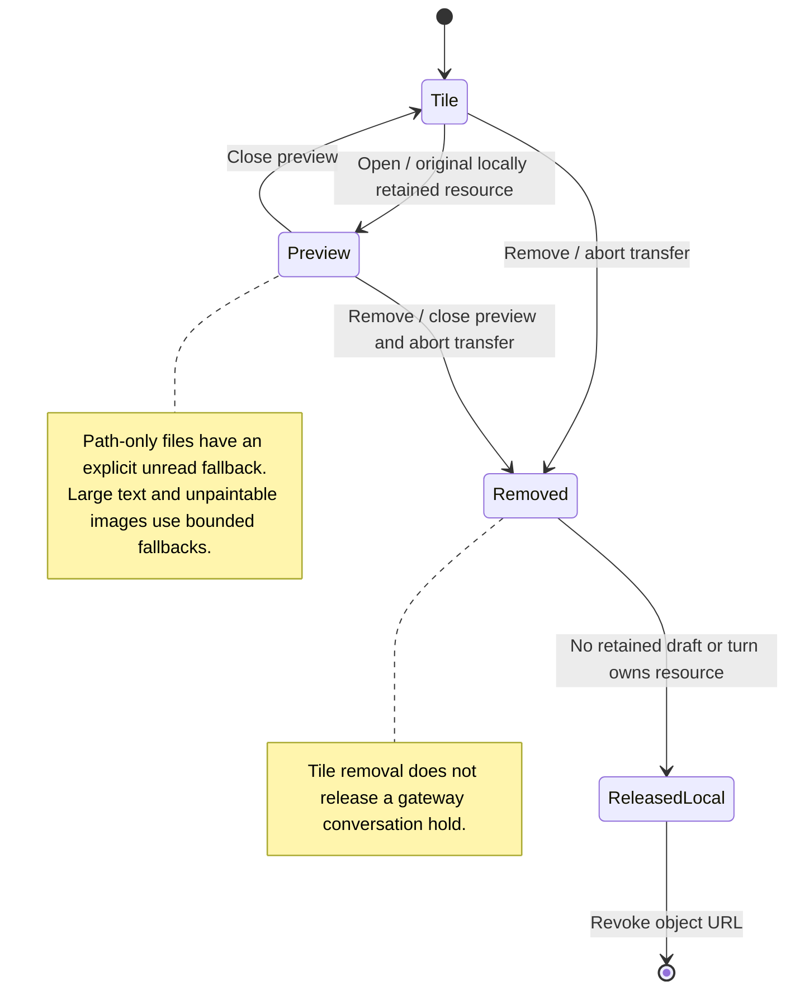

# Preview or remove a draft attachment

Opening an attachment tile previews the original file retained in this window. A path-only file has no bytes to preview and says that Nessa has not opened it. Large text files or images the browser cannot display use a simpler fallback.

Removing the tile removes that draft part and aborts its transfer. It does not release an upload already retained by the gateway. That upload can remain until the conversation is stopped or deleted.

## Further reading

[Source](../../../../../src/panel/ui/attachment-tile.tsx) · [Related source](../../../../../src/panel/ui/attachment-preview.tsx) · [Related tests](../../../../../src/composition/attachment-resources.test.ts)
