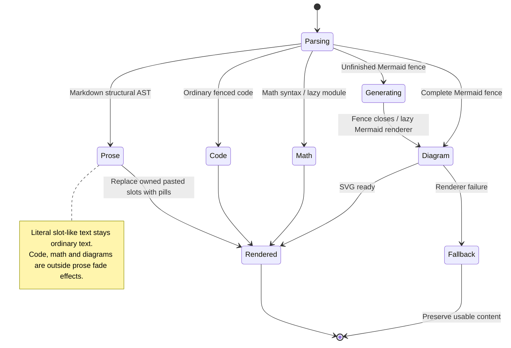

# Read rich text, code, math, and diagrams in a message

The floating panel renders Markdown, code, math and diagrams using the shared UI components. A diagram still being streamed shows a generating placeholder until its fence closes.

Pasted-text chips and attachment tiles stay separate from the surrounding Markdown. Raw HTML is not enabled. Copy uses the original content, rather than text reconstructed from the rendered view. The desktop uses a different rich-text renderer and does not promise the same capabilities.

## Further reading

[Source](../../../../../src/conversation/ui/message-content.tsx) · [Related source](../../../../../src/conversation/ui/transcript.tsx) · [Related tests](../../../../../src/conversation/ui/message-content.test.ts)
