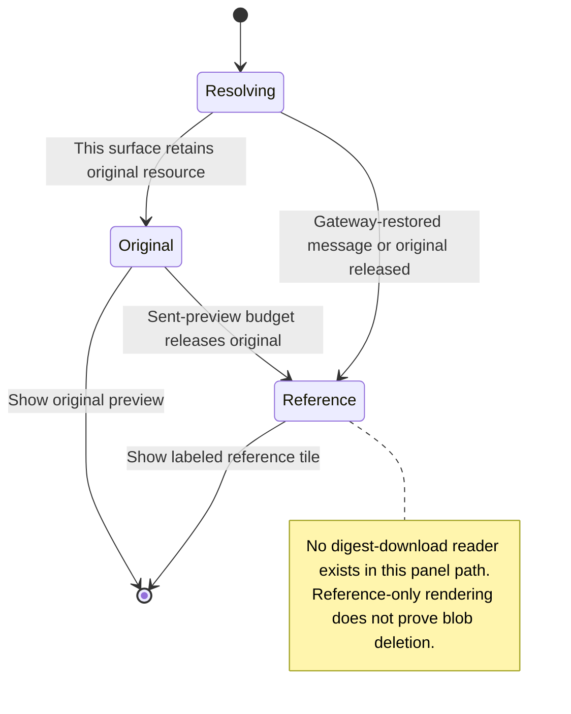

# Reopen a message and understand its reference-only attachments

A message sent from this window can still display its original local attachments. Reopened history contains image references and file paths, rather than all the original bytes.

Nessa does not fetch stored images by their digest in this flow. After reload, another surface's send, or release of the local preview budget, a labelled reference tile is expected. It does not mean the agent never received the image.

## Further reading

[Source](../../../../../src/conversation/model/content.ts) · [Related source](../../../../../src/conversation/ui/message-images.tsx) · [Related tests](../../../../../src/conversation/ui/message-content.test.ts)
