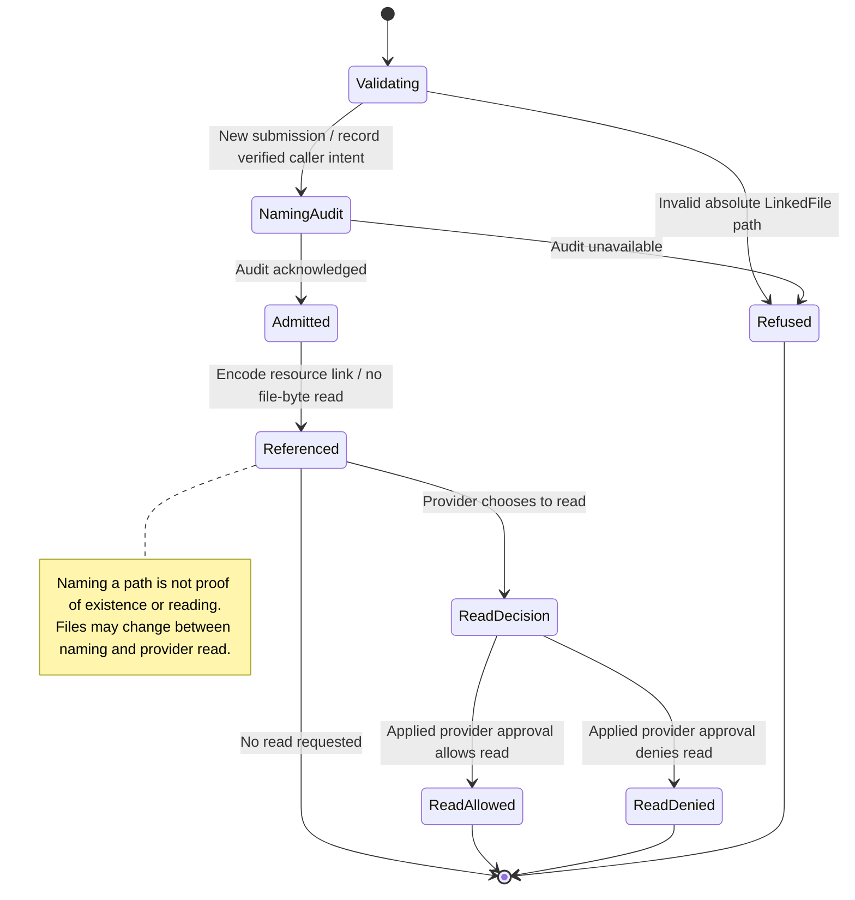

# Send a non-image file by path and approve its read

A native file attachment sends its absolute path, not its contents. Nessa checks the path's shape but does not open the file, check its existence or restrict it to the workspace at this step.

The agent decides how to read the file under its applied approval mode. Ask mode can request permission; another mode can behave differently. Attaching a path does not prove a prompt appeared, that the file was read, or that its contents stayed unchanged.

## Further reading

[Source](../../../../adr/done/0013-files-by-path-not-by-payload.md) · [Related source](../../../../../src/conversation/model/attachments.ts) · [Related tests](../../../../../crates/nessa-server/tests/conversation/linked_files.rs)
