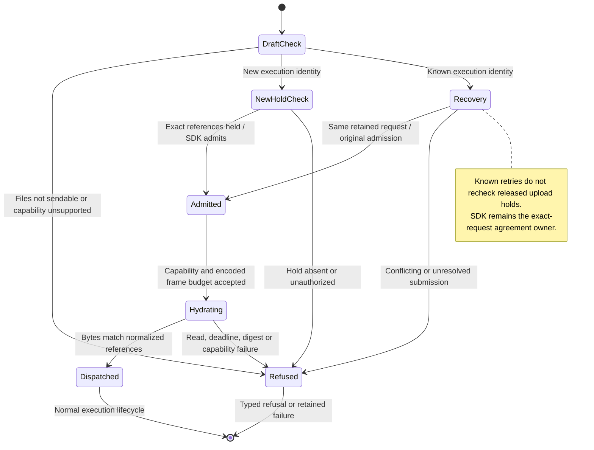

# Send uploaded images to the agent

An image-only message is valid once its uploads are ready and the selected agent supports images. The panel sends the references returned by the gateway, not the original local hashes.

One message can include up to 10 stored images totalling 10 MiB and up to 10 file links. These limits differ from the larger draft upload budget. The gateway also checks that the conversation has permission to use each stored image. Acceptance is separate from the agent receiving or processing it.

## Further reading

[Source](../../../../../src/conversation/application/usecases/send-draft.ts) · [Related source](../../../../../src/conversation/adapters/store/slice.ts) · [Related tests](../../../../../crates/nessa-server/tests/conversation/attachments.rs)
