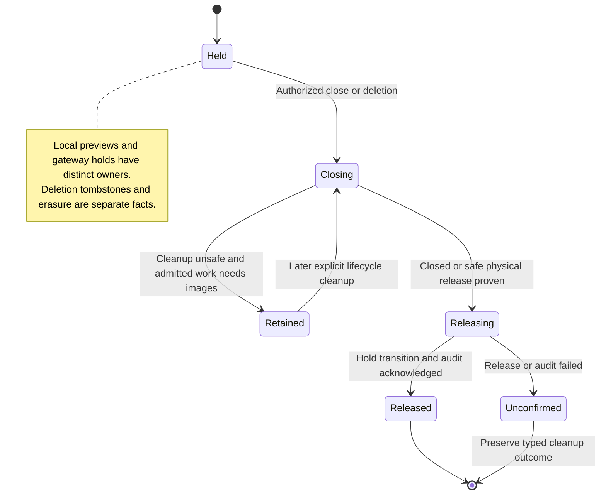

# Stop or delete a conversation and release its uploaded images

Stop ends active and waiting work. The gateway releases uploaded images when no unsettled invocation still needs them. Delete also blocks further commands, disposes of the provider session where supported, and erases Nessa-owned history and summaries.

Closing a tab normally just removes the view. Its automatic-close exception requires a proven-empty idle conversation; ordinary prepared sessions do not qualify. Deletion can be confirmed while erasure remains unfinished. Provider cleanup, local erasure and saved audit evidence are separate results.

## Further reading

[Source](../../../../../src/conversation/adapters/store/slice.ts) · [Related source](../../../../../crates/nessa-server/src/conversation/application/service.rs) · [Related tests](../../../../../crates/nessa-server/tests/attachments/application.rs)
