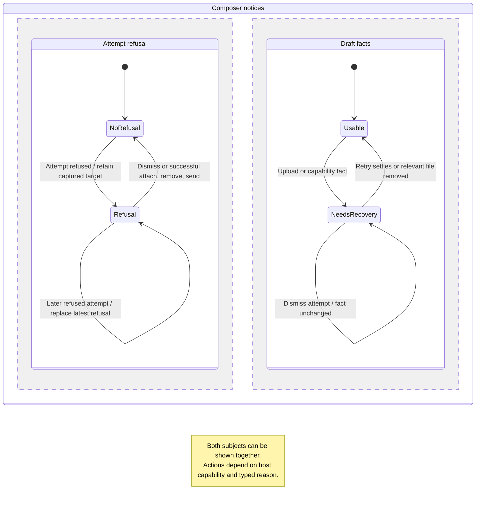

# Understand an attachment refusal and choose a useful recovery

A refusal explains whether the attachment could not be read, uploaded, normalized or included in the message. Check the stage before choosing recovery: reselect an unreadable native file, retry a failed upload, or choose a supported image format.

A file path does not supply bytes, and a successful local preview does not prove agent support. Pending work is different from a failed attempt. Removing a tile can clear a local refusal without releasing an upload already held by the gateway.

## Further reading

[Source](../../../../../src/panel/application/attachment-notice.ts) · [Related source](../../../../../src/panel/ui/attachment-notices.tsx) · [Related tests](../../../../../src/panel/application/attachment-notice.test.ts)
