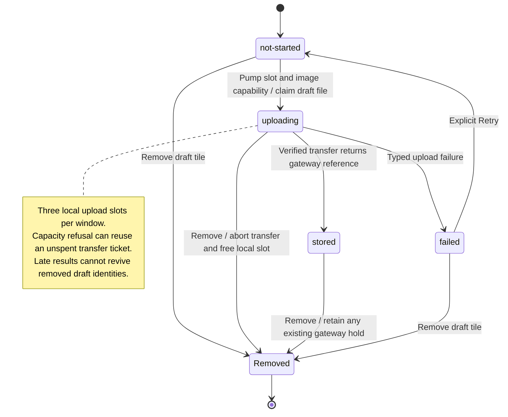

# Upload an image and retry a failed upload

Adding an image starts a transfer for the captured conversation. Nessa keeps the local original for preview and uses the gateway's returned reference for sending.

Retry starts a new upload attempt after a failure. Removing the tile aborts its transfer and frees the local slot. Gateway transfer tickets are separate from native file-read tickets: capacity refusal leaves the transfer ticket usable, while other transfer endings spend it. A slow transfer has its own three-minute deadline.

## Further reading

[Source](../../../../../src/panel/ui/use-attachment-uploads.ts) · [Related source](../../../../../src/panel/application/upload-image.ts) · [Related tests](../../../../../src/panel/application/upload-image.test.ts)
