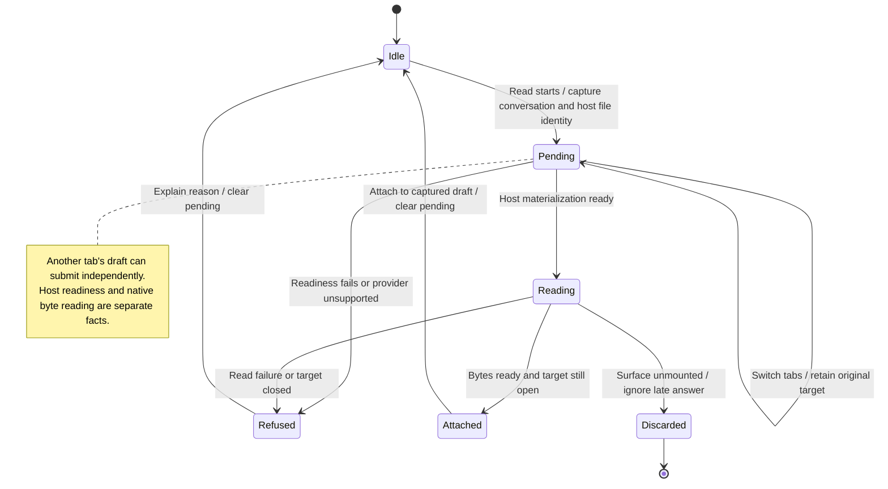

# Wait for a cloud file without attaching it to another tab

A cloud-backed image may need time to become readable. Nessa remembers the conversation that requested it and shows that read as pending. It cannot send that conversation's draft until the read finishes.

Switching to another tab does not move the pending file. The other tab can send its own text. Closing the original tab prevents a late file from attaching to its replacement. Read failure clears the pending state and explains the problem. A second read gesture is refused while the first is active.

## Further reading

[Source](../../../../../src-tauri/src/attachments/readiness.rs) · [Related source](../../../../../src-tauri/src/attachments/readiness/icloud.rs) · [Related tests](../../../../../src/panel/ui/use-file-attachments-races.test.ts)
