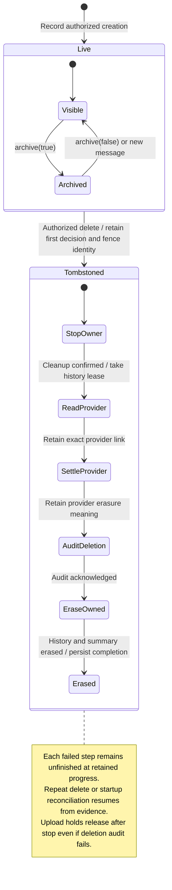
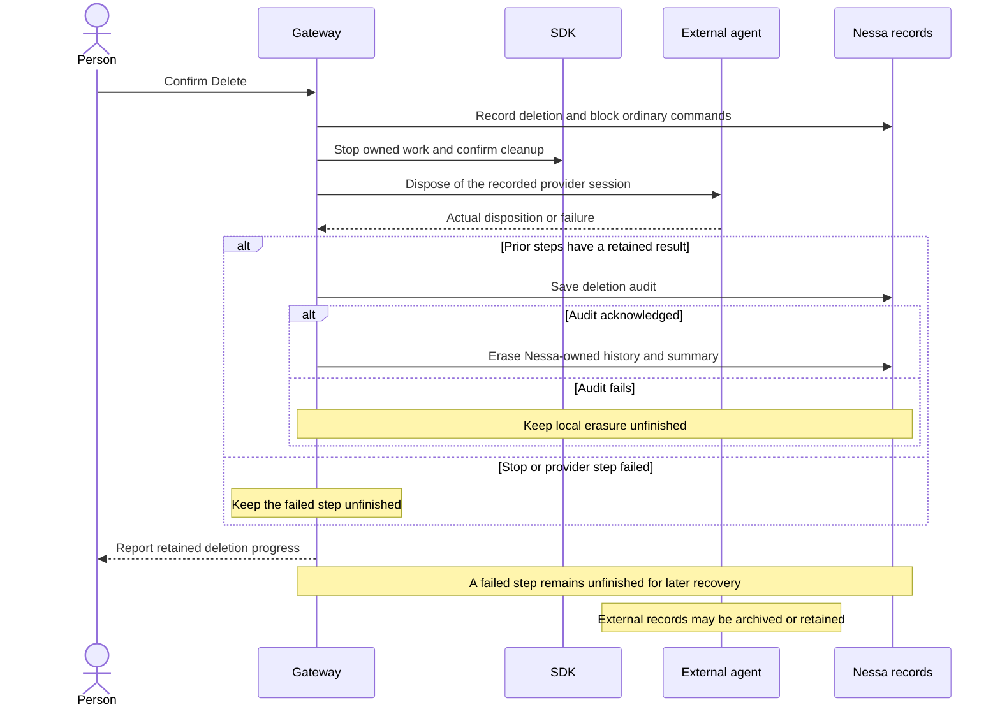

# Conversation identity and deletion

A conversation belongs to its original creator and organization. Archive changes whether it appears in lists while keeping its history and work.

Delete first records the decision and blocks ordinary commands under that identity. It then stops work, checks the provider's cleanup result and erases Nessa-owned data. Failed steps remain unfinished and can be resumed. The original decision stays attached to repeats; Nessa does not recreate the deleted identity.

## What external cleanup can mean

| Provider erasure evidence | Meaning |
| --- | --- |
| Deleted | Binding erases the provider-owned record. |
| Archived | Provider-owned record is retained as an archive. |
| Acknowledged | The provider accepted deletion; record disposition is not known. |
| NotListed | Delete was refused and a subsequent full list does not name it. |
| NotSupported / NoHandler | Provider retained its record; this path could not ask for erasure. |
| SessionUnknown | Leased local history does not establish the provider identity; do not claim no provider record. |

Nessa retains the reported provider result. Finishing local erasure does not change an archived or unknown external result into deleted.

## Deletion order

## Further reading

[Source](../../../../crates/nessa-server/src/conversation/application/service.rs) · [Related source](../../../../crates/nessa-server/src/conversation/domain/value_objects/conversation_deletion.rs) · [Related tests](../../../../crates/nessa-server/tests/conversation/deletion.rs)
