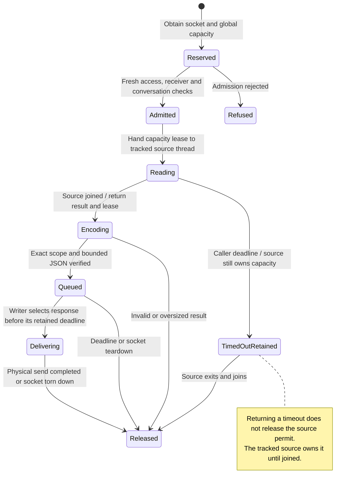

# Bounded physical history reads

An authorized reader can page through saved conversation records without starting an agent. Nessa limits both the number of records and the bytes in each response.

The read holds its source and capacity until completion, timeout and cleanup have settled. Closing the socket does not instantly make unfinished read resources available. Downloading records and applying them to a receiver's local history are separate steps.

## Further reading

[Source](../../../../crates/nessa-server/src/product/socket.rs) · [Related source](../../../../crates/nessa-server/src/product/record_read/dispatch.rs) · [Related tests](../../../../crates/nessa-client-core/tests/read_only_sync/gateway/deadline_stream.rs)
