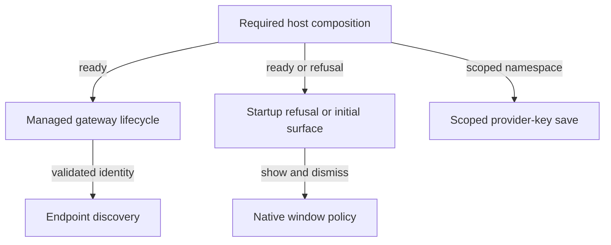
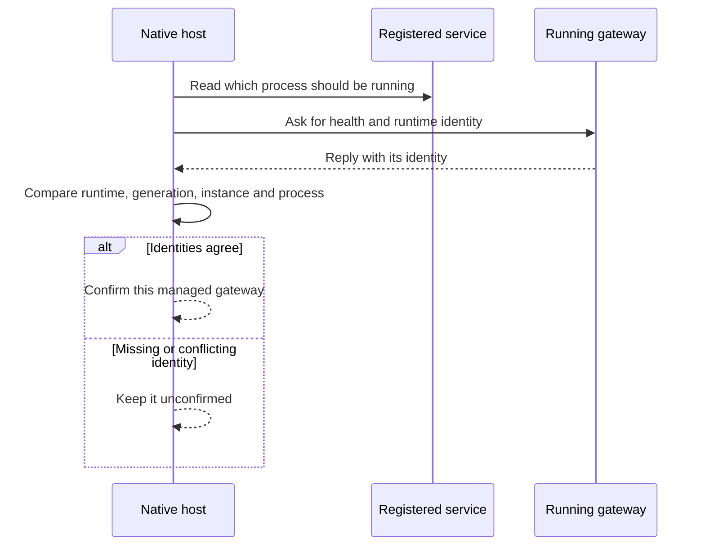

# Native host

The native host connects Nessa to your computer. It opens windows, loads local settings and credentials, and starts the packaged gateway in the background.

This map shows the parts that work together. The arrows describe what one part supplies to another, not a single sequence of states. A ready app, a ready gateway and a signed-in agent are separate things.

## Host dependencies are ready

“Ready” here means the app has assembled the local services it needs. Its required plugins registered, its settings could be read, and its folders, service configuration and packaged resources could be resolved.

If a required part is missing or invalid, startup is refused and Nessa shows a way to retry or quit. Passing this check lets gateway startup begin; it does not mean the gateway has answered yet. A missing tray or a window styling failure can reduce what is available without refusing the whole app.

See [launch and the first screen](startup/launch-and-choose-the-first-surface.md). Source checks are in [host composition](../../../../src-tauri/src/composition.rs) and [startup handling](../../../../src-tauri/src/startup.rs).

## Choosing the first screen

If the host cannot assemble the required parts, Nessa shows the startup problem with Try again and Quit. If it can, unfinished onboarding opens setup; completed onboarding opens the desktop.

Gateway startup runs separately, so opening a screen does not prove that a conversation is ready to connect. There is also a current limitation: if the frontend's startup question itself fails, it continues as if the host were ready. That fallback is documented as a gap, not a successful check.

See [launch and the first screen](startup/launch-and-choose-the-first-surface.md) and [setup](startup/complete-setup-choose-an-agent-and-learn-the-shortcut.md).

## Checking the gateway identity

A reply from a local port is not enough. For the managed gateway, Nessa checks that the running process is the one it prepared and registered. The runtime version's fingerprint, service generation, running instance and process ID must agree with the service's reported identity.

Endpoint discovery also compares the saved connection address with the live gateway's health reply. Contradictory identities are refused rather than treated as ready. A matching reply establishes which gateway was found; sign-in and permission checks still happen separately. If no saved endpoint can be read, the caller's existing fallback applies, so that absence must not be described as successful validation.

See [gateway recovery](startup/recover-or-update-the-managed-gateway.md) and [endpoint discovery](../endpoint/endpoint-discovery.md). The diagram summarizes the managed-service identity check; endpoint discovery is a separate check with its own fallback. See [macOS checks](../../../../src-tauri/src/gateway/infrastructure/macos.rs), [Linux checks](../../../../src-tauri/src/gateway/infrastructure/linux/reconciliation.rs) and [endpoint access](../../../../src-tauri/src/gateway_endpoint/application/resolve.rs).

## Choosing the credential store

Nessa keeps provider keys separate for each local service setup. The configured data root, development or release stage, and service instance determine which store entry is used. A key saved for one setup should not silently replace another setup's key.

Before saving, Nessa checks that the store's destination matches the expected destination for that agent. A mismatch or an unreadable destination prevents the write. This checks where the key will go, not whether the provider will accept it. Native key storage is currently available on macOS; other native adapters report it as unavailable.

See [saving provider credentials](startup/save-provider-credentials-and-download-a-runtime.md). The matching rule is in [the save operation](../../../../src-tauri/src/agent_credentials/application/save_api_key.rs).

## Showing and hiding windows

The native host asks the operating system to show, focus, hide or resize Nessa's windows. The desktop and floating panel have their own rules for opening and closing.

Hiding a window does not stop agent work. A request to show or hide it also does not guarantee that the operating system performed every part of the request. Platform limits and errors are handled by the window code.

See [desktop window behavior](../desktop/workspace/open-dismiss-and-reopen-the-desktop-window.md) and [summoning the panel](../desktop/workspace/summon-or-dismiss-the-floating-panel.md).

## Browse startup

[Startup and access flows](startup/README.md) · [Current gaps](../../gaps.md)
