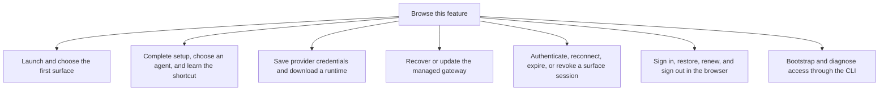

# Startup and access

Startup chooses the first screen, checks agent readiness and establishes access to the gateway. The native host can manage a local gateway; a browser connects to one already running.

Host ready, gateway ready and agent ready mean different things. A saved provider key is also different from a valid gateway token or a successful agent sign-in.

## Feature overview

These boxes open related pages. They are parts of the system, rather than mutually exclusive runtime states.

## Browse flows

- [Authenticate, reconnect, expire, or revoke a surface session](authenticate-reconnect-expire-or-revoke-a-surface-session.md)
- [Bootstrap and diagnose access through the CLI](bootstrap-and-diagnose-access-through-the-cli.md)
- [Complete setup, choose an agent, and learn the shortcut](complete-setup-choose-an-agent-and-learn-the-shortcut.md)
- [Launch and choose the first surface](launch-and-choose-the-first-surface.md)
- [Recover or update the managed gateway](recover-or-update-the-managed-gateway.md)
- [Save provider credentials and download a runtime](save-provider-credentials-and-download-a-runtime.md)
- [Sign in, restore, renew, and sign out in the browser](sign-in-restore-renew-and-sign-out-in-the-browser.md)
