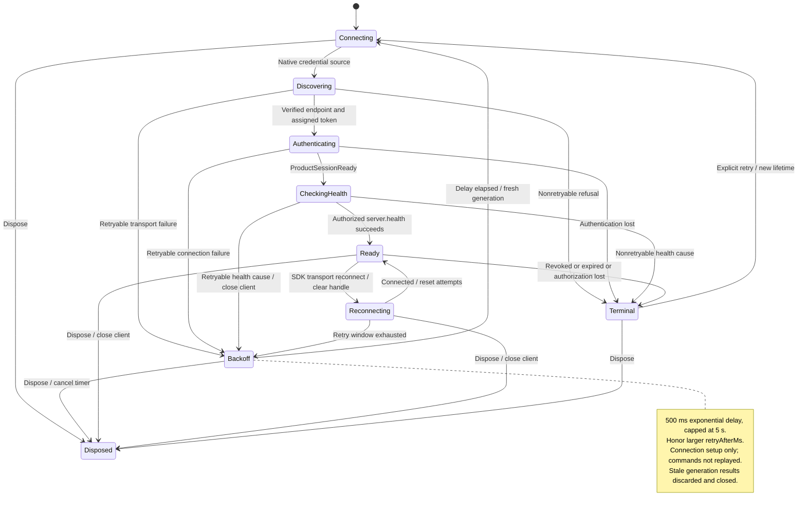

# authenticate, reconnect, expire, or revoke a surface session

The native panel can obtain its gateway credential only from an allowed bundled window, for the expected stage and local destination. Unsafe, missing or invalid credential storage is refused before its secret is used.

The host also allows the desktop window to read the panel credential, with the same stage and destination checks. Unlike panel and setup loads, the desktop read requires an already-ready startup snapshot and cannot trigger reconciliation. [GatewayReader](../../../../../src-tauri/src/gateway/infrastructure/commands.rs) owns that distinction.

Connection setup retries temporary failures with a limited backoff. Terminal failures need explicit Retry. Old connection attempts cannot replace the current one. Reconnect does not replay conversation commands. Revocation blocks later admitted commands, but work already admitted can finish.

## Further reading

[Source](../../../../../src/session/adapters/client/credential-source.ts) · [Related source](../../../../../src-tauri/src/surface_credential.rs) · [Related tests](../../../../../src/session/adapters/client/credential-source.test.ts)
