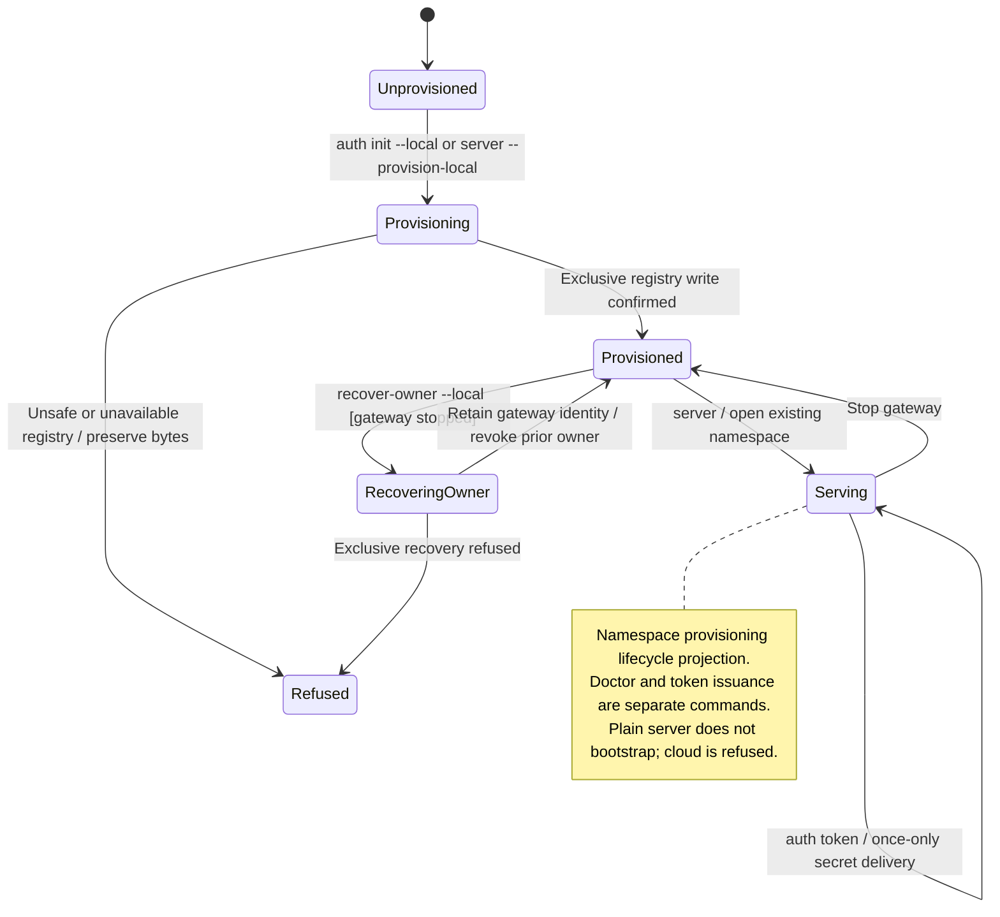

# bootstrap and diagnose access through the CLI

The CLI can diagnose an existing gateway, issue access tokens and perform explicit local setup or recovery. Starting the server does not silently create or replace its identity.

Online commands use authenticated gateway access. Offline recovery needs exclusive access to the credential file and preserves the gateway's identity. An unsafe file is left unchanged. A newly issued token is revealed once; issuing it is not automatically retried. Revocation survives restart and blocks later access checks.

## Further reading

[Source](../../../../guides/local-auth.md) · [Related source](../../../../../crates/nessa-server/src/cli/entrypoint/arguments.rs) · [Related tests](../../../../../crates/nessa-server/tests/cli/application.rs)
