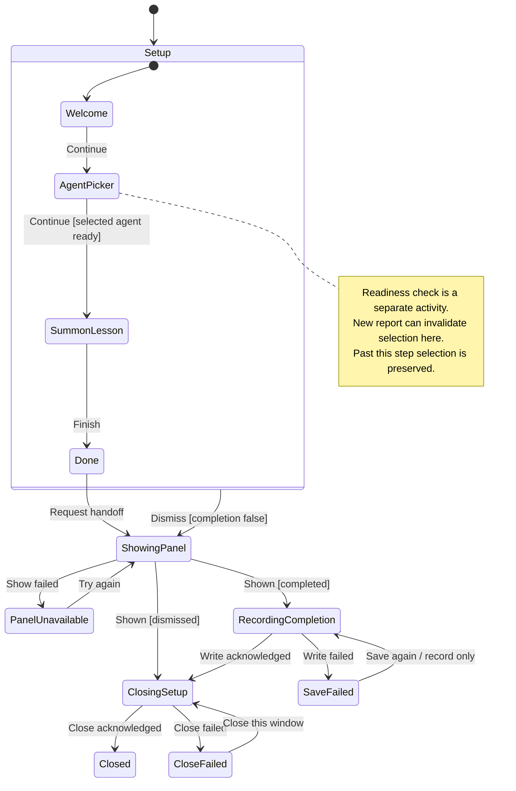

# complete setup, choose an agent, and learn the shortcut

Setup walks through welcome, agent choice and the summon shortcut before finishing. Claude, Codex and OpenCode are listed, but only an agent reported as ready can be selected.

Ready means the probe found the required installation, configuration and authentication for that agent. Missing installation, missing configuration, missing sign-in and an unknown result remain different states. A fresh report can invalidate a choice while the picker is open. Finishing saves the chosen agent; a save or window-close failure offers recovery instead of claiming setup completed.

## Further reading

[Source](../../../../../src/onboarding/model/onboarding.ts) · [Related source](../../../../../src/onboarding/ui/use-onboarding.ts) · [Related tests](../../../../../src/onboarding/model/onboarding.test.ts)
