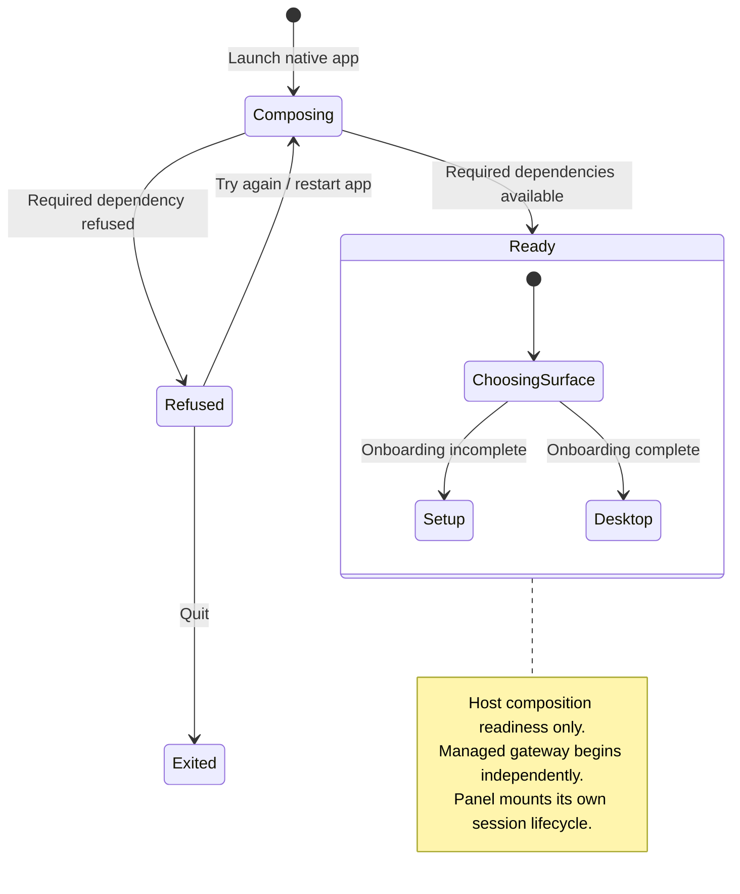

# launch and choose the first surface

The native host first assembles the dependencies required to start Nessa. If that fails, it opens a refusal screen with retry or quit instead of continuing with a partly assembled app.

A ready host can still have a starting or failed gateway. Tray, sizing and shortcut failures can degrade the surface independently. The frontend asks for host status before mounting product state; a failed status query currently falls back to ready, which can hide that distinction.

## Further reading

[Source](../../../../../src-tauri/src/startup.rs) · [Related source](../../../../../src-tauri/src/main.rs) · [Related tests](../../../../../src/startup/ui/startup-refused.test.ts)
