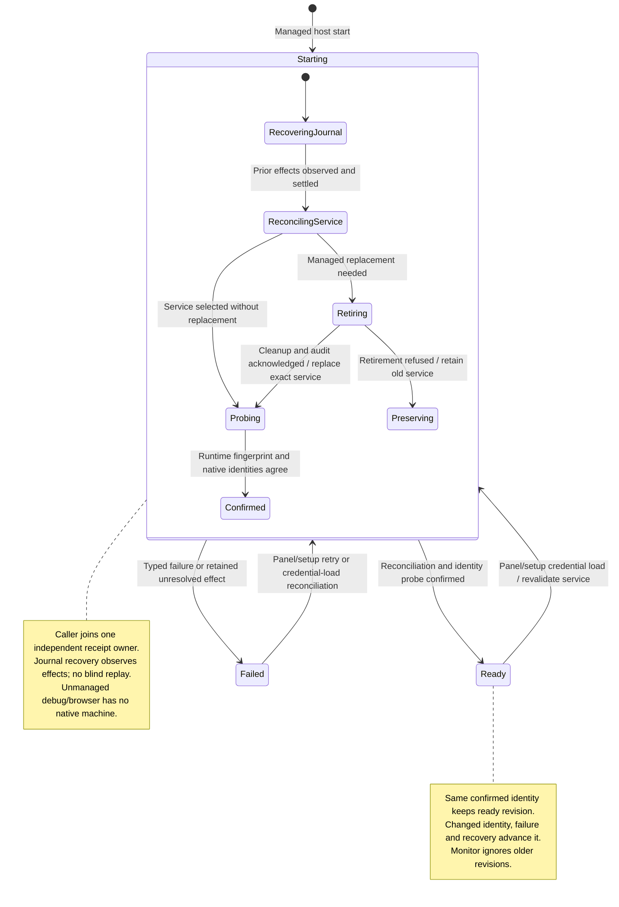

# recover or update the managed gateway

The native host starts or reconciles the configured gateway. It reports starting, ready or failed. Ready requires a matching service process and live gateway identity, rather than just an HTTP response.

Panel and setup credential loads check readiness again. The desktop window only reads the ready startup snapshot; it does not reconcile the gateway. If that snapshot is starting or failed, its read is refused. Recovery observes recorded progress before repeating effects, and old processes must be safely retired. A failure can preserve the existing service for investigation. Browser and unmanaged debug paths have no native service owner. Configuration-change handling exists as a test path, not a live settings subscription.

## Further reading

[Source](../../../../../src-tauri/src/gateway/application/service.rs) · [Related source](../../../../../src-tauri/src/gateway/infrastructure/commands.rs) · [Related tests](../../../../../src/startup/application/gateway-startup.test.ts)
