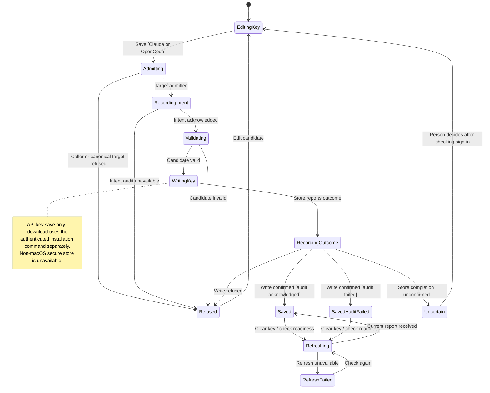

# save provider credentials and download a runtime

A provider API key lets an external agent authenticate; it is different from the token used to access Nessa's gateway. Native setup can save Claude and OpenCode keys on macOS. Codex sign-in remains external, and the other native secure-store adapter is unavailable.

Nessa records intent before writing. A failed intent record prevents the save. If the key was written but the outcome record fails, it remains saved with a warning. An uncertain write is not proof that nothing changed. Runtime installation downloads Nessa's tested version; installing it does not sign the agent in.

## Further reading

[Source](../../../../../protocol/defaults/agent-credentials.json) · [Related source](../../../../../src/composition/browser-gate.tsx) · [Related tests](../../../../../src/onboarding/ui/agent-api-key-form.test.tsx)
