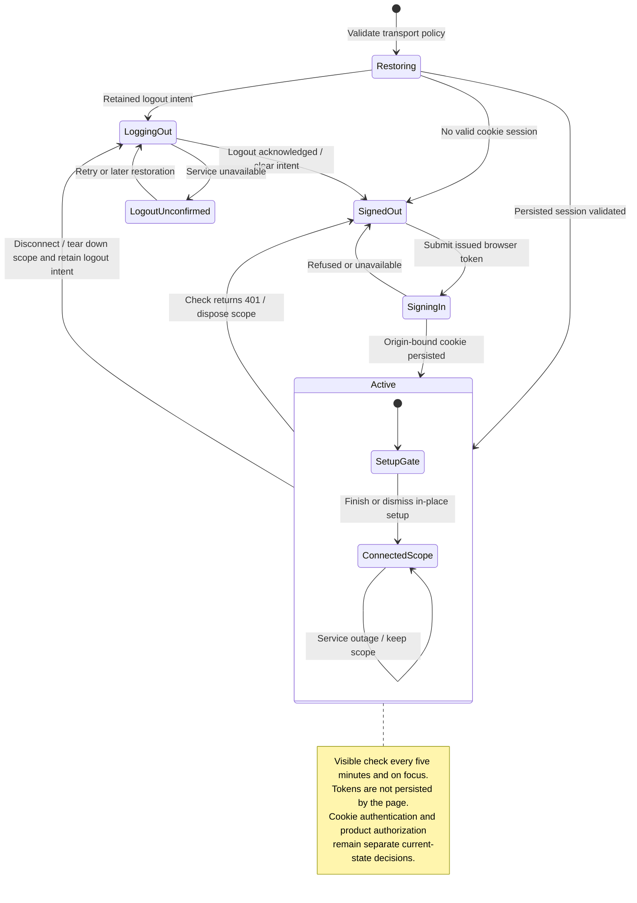

# sign in, restore, renew, and sign out in the browser

Browser sign-in establishes a server-backed session cookie. The page does not keep the gateway token in local or session storage. Reload can restore the session while it remains valid.

Renewal extends the browser's idle lifetime within the credential's current validity. Trusted-origin checks still apply, and expiry or revocation can require sign-in again. Sign-out first tears down local access and retains logout intent so a failed request can be retried. A local sign-out view alone does not prove server-side logout finished.

## Further reading

[Source](../../../../../src/composition/browser.tsx) · [Related source](../../../../../src/session/adapters/client/browser-auth.ts) · [Related tests](../../../../../src/session/adapters/client/browser-auth.test.ts)
