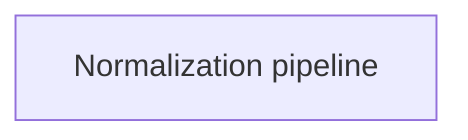

# Image normalization

The image library checks and resizes images for a supported agent. It handles format and memory limits without storing images or contacting a service.

An unsupported format or an image that cannot fit is refused. Supported formats can differ by operating system.

## Owner map

These boxes open related pages. They are parts of the system, rather than mutually exclusive runtime states.

## Browse this area

- [Normalization pipeline](images-normalization.md)
