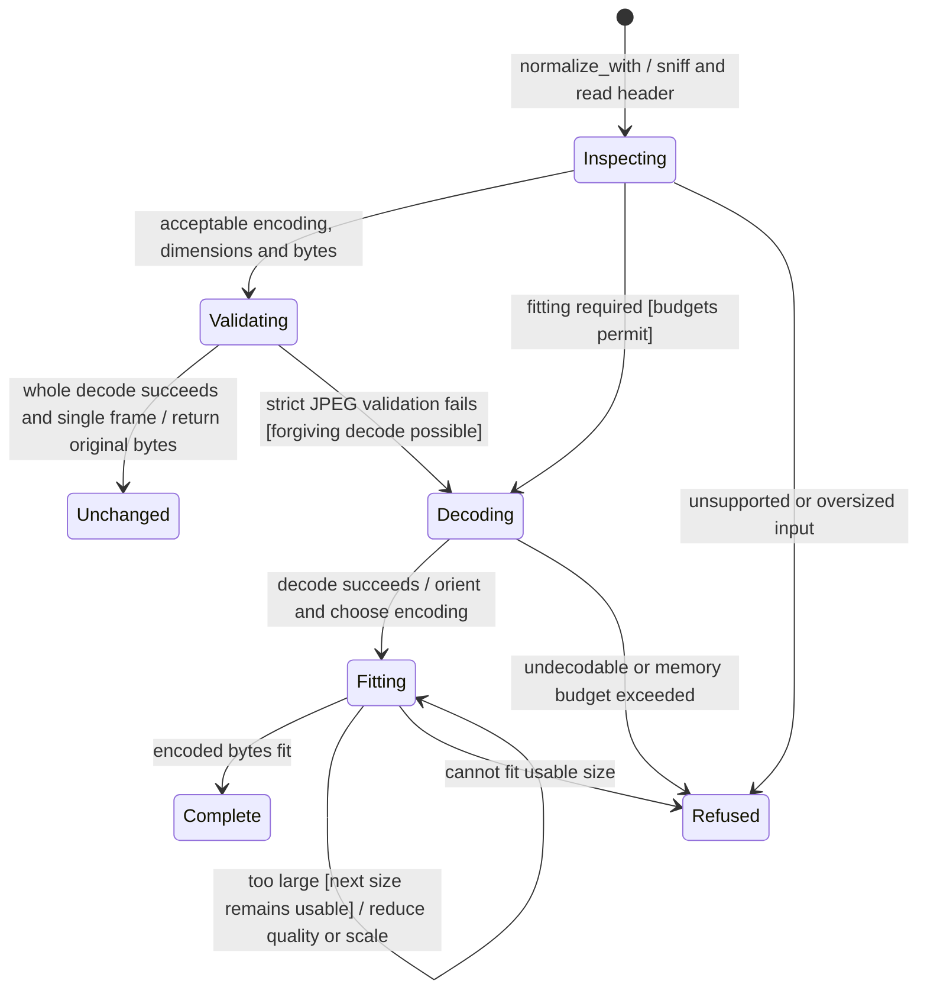

# Normalization pipeline

The image library checks the bytes, handles orientation and fits the image to the requested limits. It may keep an already suitable image, resize it, or encode it as PNG or JPEG.

Decoding, pixel count and memory use are bounded. Unsupported formats or images that cannot fit are refused. Platform decoders can add format support, but that support is not available on every operating system. This library does no storage or network work and has no persistent lifecycle.

## Further reading

[Source](../../../../crates/nessa-images/src/normalize.rs) · [Related source](../../../../crates/nessa-images/src/lib.rs)
