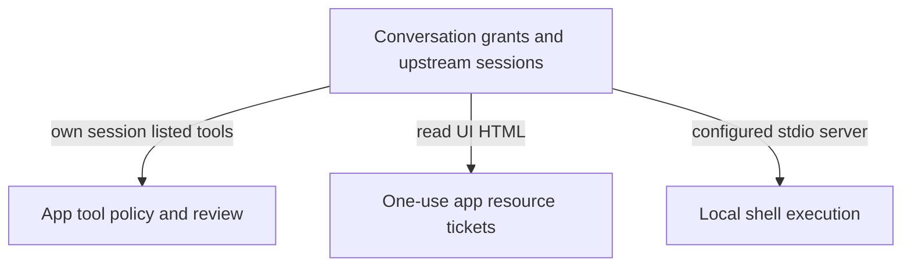

# MCP sessions and tools

MCP connects agents and interactive apps to tools. Nessa routes a conversation through its configured tool servers and also provides its own local tools.

Access grants, tool approval and one-use app downloads have separate lifetimes. Provider-native tools remain owned by the external agent.

## Owner map

These boxes open related pages. They are parts of the system, rather than mutually exclusive runtime states.

## Browse this area

- [One-use app resource tickets](resource-tickets.md)
- [Conversation grants and upstream sessions](sessions.md)
