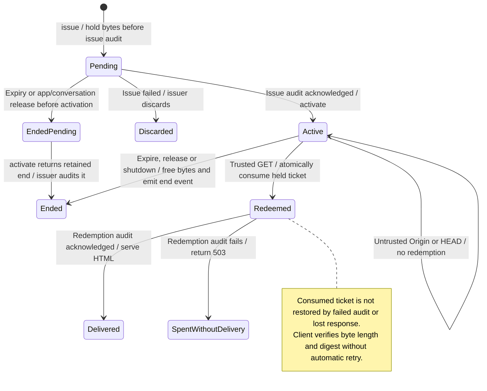
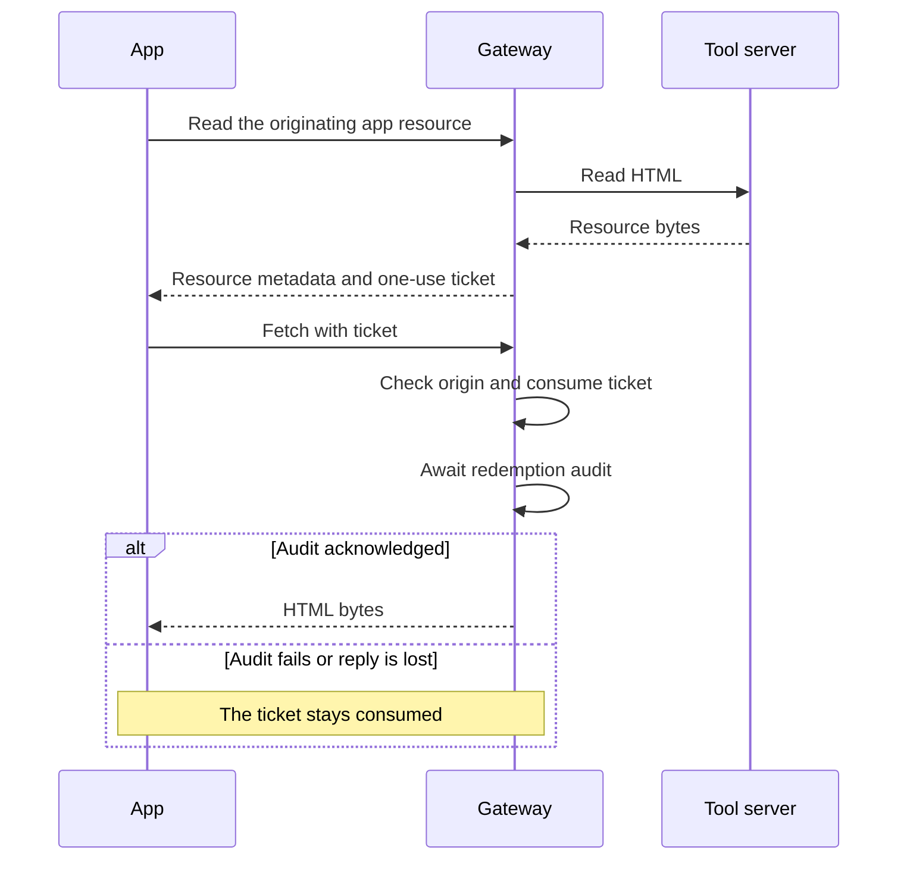

# One-use app resource tickets

A resource ticket lets an app fetch one prepared HTML resource. It expires after 60 seconds and can be used only once. Nessa keeps the bytes until redemption, expiry or explicit release.

Redemption consumes the ticket before returning the bytes and waits for its audit record. A lost reply or failed audit does not make the ticket reusable. Expiry can free the bytes even if its separate audit event fails. These tickets are different from file-read and image-upload tickets.

## Downloading once

## Further reading

[Source](../../../../crates/nessa-server/src/mcp_servers/infrastructure/resource_tickets.rs) · [Related source](../../../../crates/nessa-server/src/conversation/application/service/app_calls.rs) · [Related tests](../../../../crates/nessa-server/tests/mcp_servers/resource_tickets.rs)
