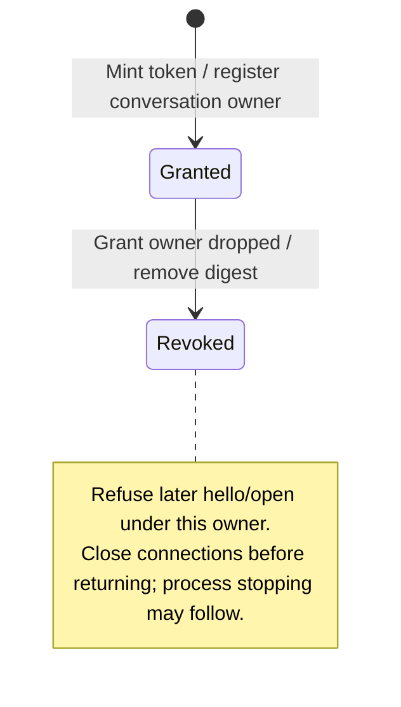
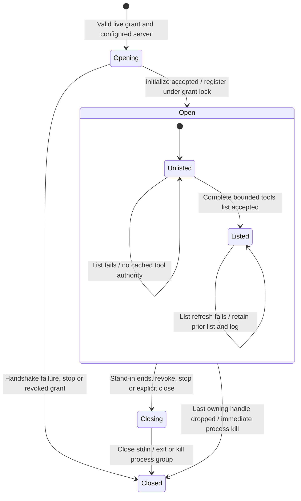

# Conversation grants and upstream sessions

An agent and its app need to talk to the same configured tool server. Nessa gives each provider opening a fresh access grant and routes their requests through a local relay rather than letting a tool choose an executable.

The grant is a secret token tied to that conversation's current opening. Revoking it prevents new use and closes logical sessions, but does not itself prove the external process stopped. An app can see only tools allowed for apps; model-visible tools can have different visibility. A failed tool-list refresh can leave the previous accepted list available.

## Further reading

[Source](../../../../crates/nessa-server/src/mcp_servers/infrastructure/grants.rs) · [Related source](../../../../crates/nessa-sdk/src/infrastructure/mcp/servers.rs) · [Related tests](../../../../crates/nessa-server/tests/mcp_servers/mod.rs)
