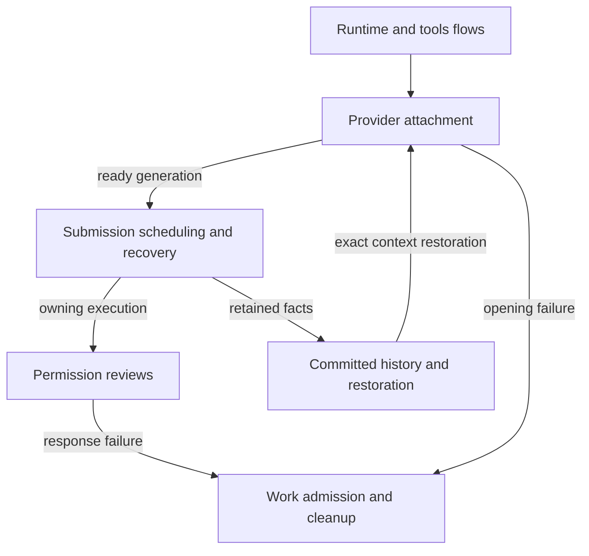

# Agent SDK

The SDK manages one live agent owner per conversation. It opens the external agent, schedules inputs, handles waiting requests and saves history.

These concerns can be active together. Stopping work, releasing a process and saving the cleanup record are separate results, so each has its own page.

## Owner map

These boxes open related pages. They are parts of the system, rather than mutually exclusive runtime states.

## Browse this area

- [Authoring and maintaining statecharts](../../authoring.md)
- [Provider attachment](attachment.md)
- [Work admission and provider cleanup](cleanup.md)
- [Committed history and restoration](history.md)
- [Permission choice and response delivery](reviews.md)
- [Runtime and tools](runtime/README.md)
- [Submission scheduling and recovery](scheduling.md)

Ownership snapshots use [bounded physical SQLite work](../storage/README.md#physical-adapter-work)
owned by each store instance. Snapshot revision authority remains with the
coordinator; this adapter lifetime is separate from submission scheduling.
