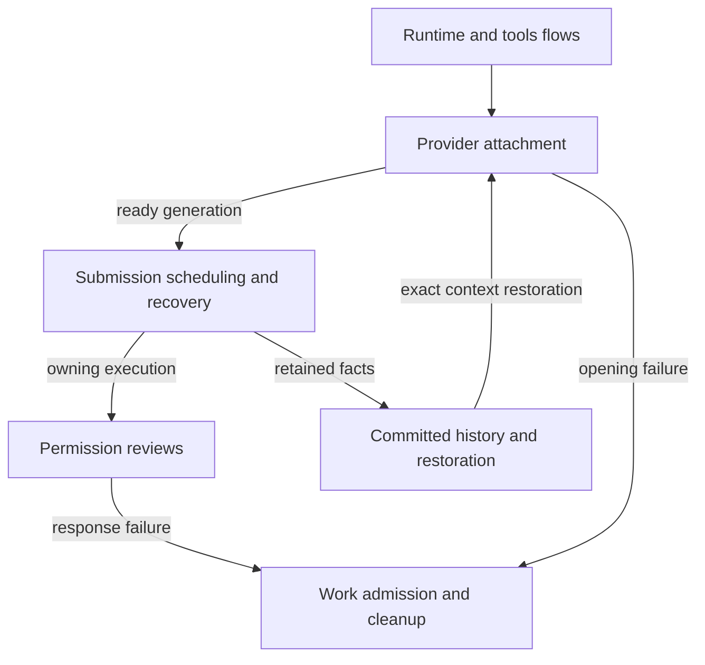

# Agent SDK

The SDK manages one live agent owner per conversation. It opens the external agent, schedules inputs, handles waiting requests and saves history.

These concerns can be active together. Stopping work, releasing a process and saving the cleanup record are separate results, so each has its own page.

## Owner map

These boxes open related pages. They are parts of the system, rather than mutually exclusive runtime states.

## Browse this area

- [Authoring and maintaining statecharts](../../authoring.md)
- [Provider attachment](attachment.md)
- [Work admission and provider cleanup](cleanup.md)
- [Committed history and restoration](history.md)
- [Permission choice and response delivery](reviews.md)
- [Runtime and tools](runtime/README.md)
- [Submission scheduling and recovery](scheduling.md)

Ownership snapshots use [bounded physical SQLite work](../storage/README.md#physical-adapter-work)
owned by each store instance. Snapshot revision authority remains with the
coordinator; this adapter lifetime is separate from submission scheduling.

## Parent and child close settlement

The [ownership graph](../../../../crates/nessa-sdk/src/domain/agent_execution/subagents/graph/settlement.rs)
owns exact resource observation debt, actual absence proof and first close scope.
The [coordinator](../../../../crates/nessa-sdk/src/application/agent_execution/subagents/coordinator.rs)
owns one drain generation and ordered snapshot writes. The ordering contract and
regression names live in [ADR329](../../../adr/todo/329-subagents.md#owned-settlement-and-supervision-625-646-649).

```mermaid
stateDiagram-v2
    Open --> Closing: first close seals admission
    Closing --> Closing: install actual resource or absence proof; retry exact audit debt
    Closing --> ClosingSafety: owned proof ready and independent child closes complete
    ClosingSafety --> Completion: covering Closing snapshot acknowledged
    Completion --> Closing: Completion audit fails; explicit retry
    Completion --> Closed: exact Completion audit acknowledged
    Closed --> Closed: final snapshot failure permits writer retry
```

Physical release returns capacity before auditing its exact observation. A Released
resource can therefore remain Closing while audit debt exists. Each independently
closing child keeps its own operation; the parent's drain joins that child's
Completion. An acknowledged Closing proof lets resume recover a rejected final
Closed write without inferring ownership from empty memory.

The [public lifecycle regressions](../../../../crates/nessa-sdk/tests/application/agent_execution/subagents.rs)
exercise startup rejection, selective coordinator audit rejection and terminal
store recovery. The [SQLite cases](../../../../crates/nessa-sdk/src/infrastructure/session_storage/ownership/tests/settlement.rs)
exercise real reopen and reject contradictory or proofless settlement bodies.
