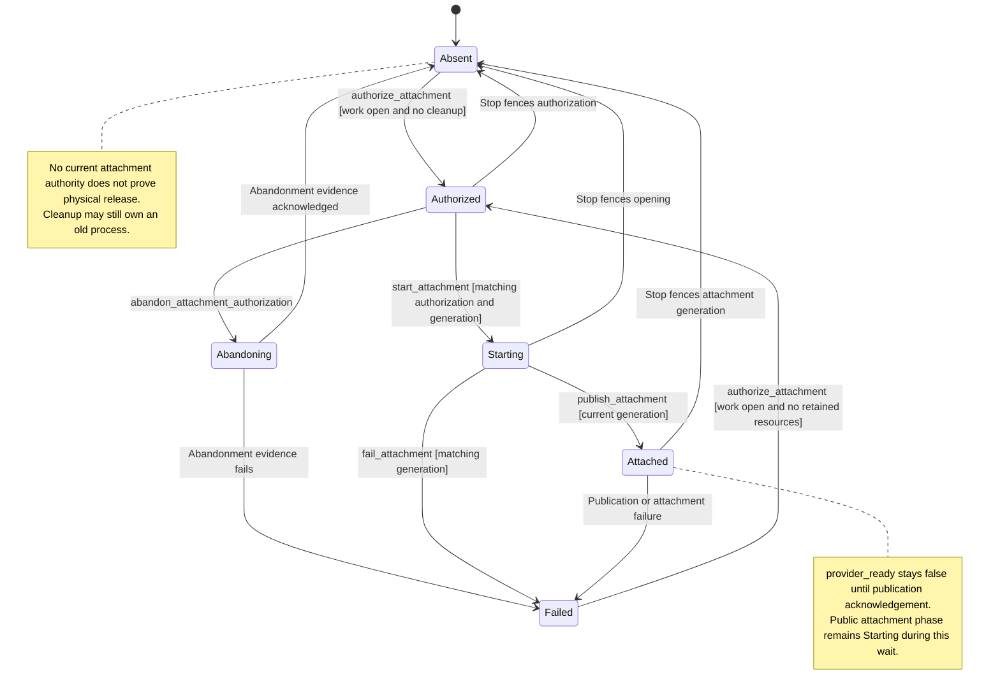

# Provider attachment

This follows one conversation connecting to its external agent. Nessa gives one opening attempt permission to start, then marks it ready after the required publication record is saved. Here, attachment means the agent connection, not a file upload.

Work can be accepted while the agent is starting. Stop invalidates the current opening attempt. A late success cannot make an old attempt ready, but any process it created still needs cleanup. Failure to save readiness also leaves cleanup and audit evidence attached to that same attempt.

## Further reading

[Source](../../../../crates/nessa-sdk/src/application/agent_execution/agents/lifecycle.rs) · [Related source](../../../../crates/nessa-sdk/src/application/agent_execution/agents/attachment.rs) · [Related tests](../../../../crates/nessa-sdk/tests/application/agent_execution/agents/initialization/startup_control.rs)
