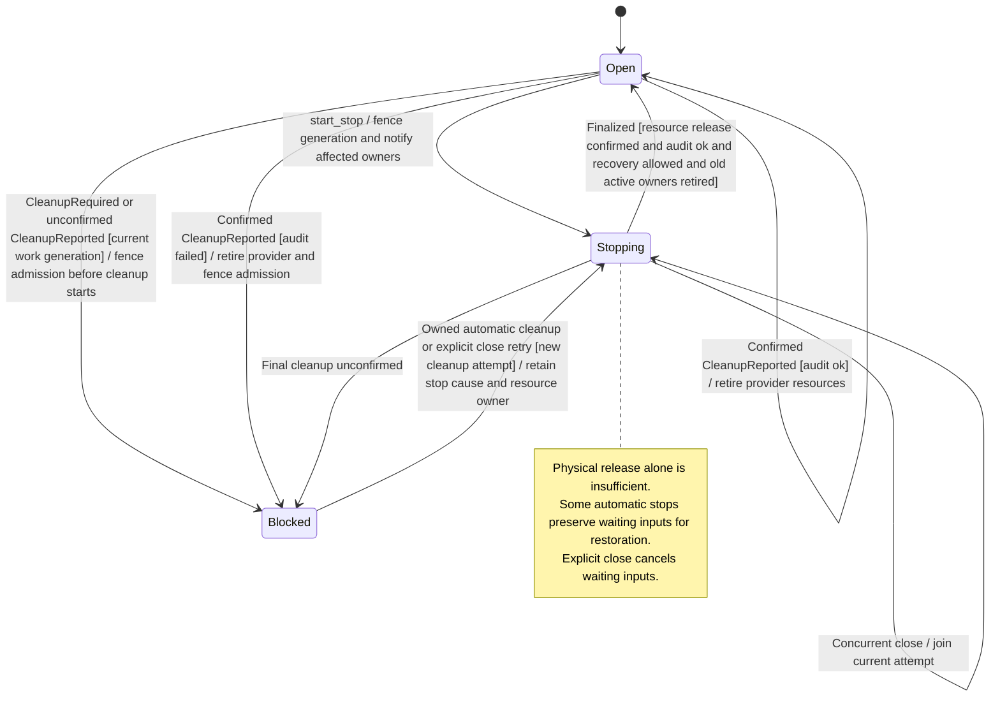

# Work admission and provider cleanup

When work is stopped, Nessa blocks new work for that owner and finishes the accepted work's cancellation and cleanup. It keeps the first cancellation cause instead of replacing it with a later caller's reason.

Cancelled work, a stopped process, released files and a saved audit record are separate facts. Recovery waits for the required cleanup and settlement. If cleanup is uncertain, Nessa retains the owner and retries rather than assuming the resources are free.

## Further reading

[Source](../../../../crates/nessa-sdk/src/application/agent_execution/agents/lifecycle.rs) · [Related source](../../../../crates/nessa-sdk/src/application/agent_execution/agents/attachment_evidence.rs) · [Related tests](../../../../crates/nessa-sdk/tests/application/agent_execution/agents/review_regressions/cleanup_audit.rs)
