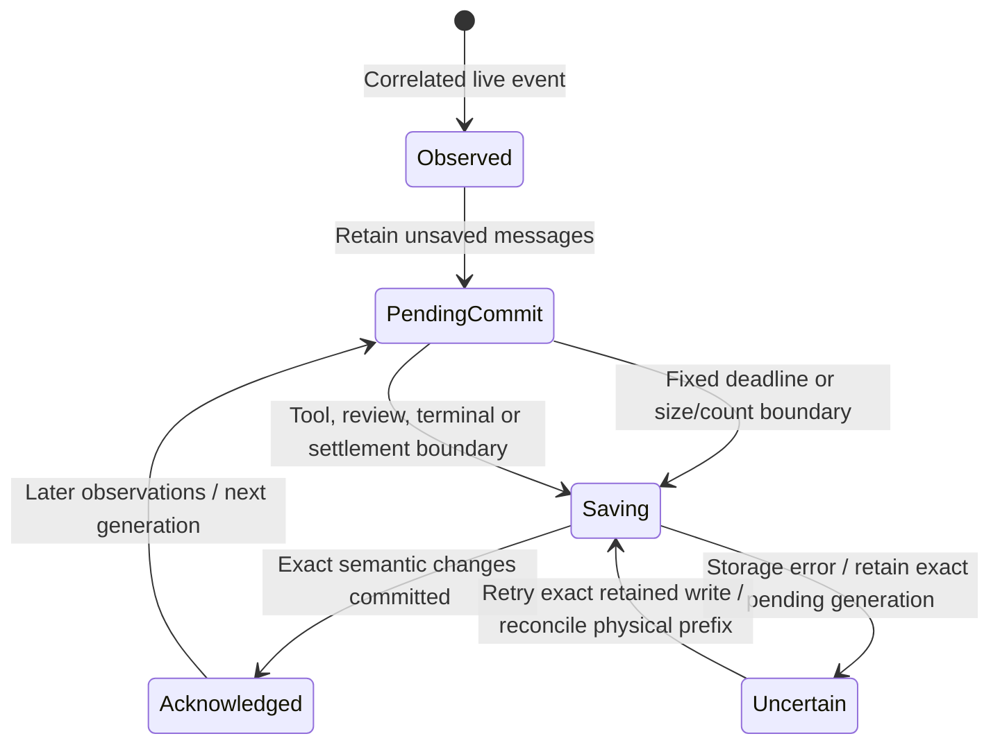
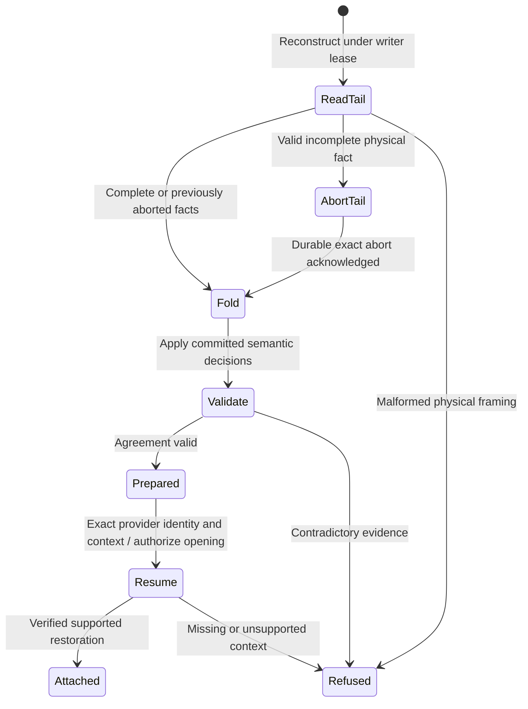

# Committed history and restoration

Nessa shows live output while saving conversation records in small batches. Reopening reconstructs history from the records that were successfully saved.

Text shown since the last successful save can be lost on a crash. A failed save is not advertised as committed history. Each save attempt has an identity so a retry can confirm an already-completed write without duplicating it. Reset must settle uncertain erasure before loading or saving new history.

## Further reading

[Source](../../../../crates/nessa-sdk/src/application/agent_execution/sessions/manager.rs) · [Related source](../../../../crates/nessa-sdk/src/infrastructure/session_storage/record_writer.rs) · [Related tests](../../../../crates/nessa-sdk/tests/application/agent_execution/agents/streaming_persistence.rs)
