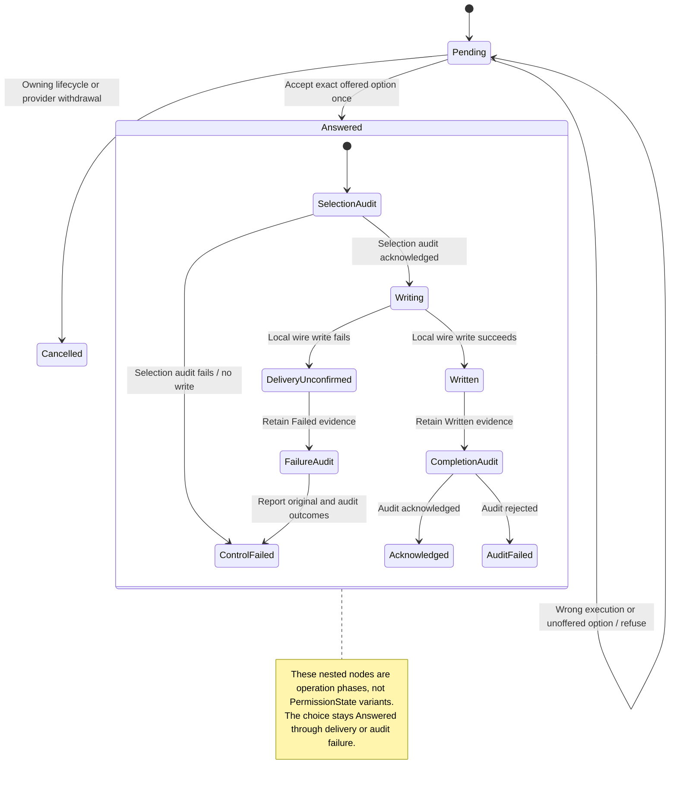

# Permission choice and response delivery

An agent can pause to ask whether a tool action is allowed. The request belongs to one execution and offers specific choices. Choosing an answer consumes that request locally.

Sending the answer and saving its audit record are later steps. A completed local write does not prove the agent performed the tool. A failed or missing reply does not reopen a consumed choice for automatic replay. Read the current request state before taking another action.

## Further reading

[Source](../../../../crates/nessa-sdk/src/domain/agent_execution/permissions/entities/permission_request.rs) · [Related source](../../../../crates/nessa-sdk/src/application/agent_execution/permissions/answer.rs) · [Related tests](../../../../crates/nessa-sdk/tests/infrastructure/acp/contracts/permissions/answers.rs)
