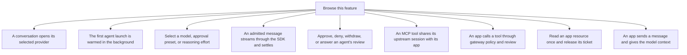
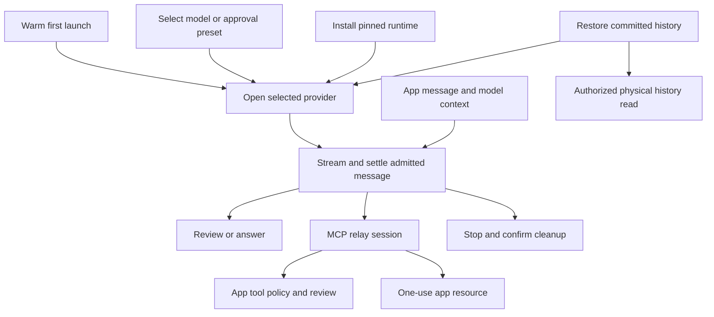

# Runtime and tools

These flows follow work after it reaches the gateway: opening an agent, executing input, answering requests, saving history and cleaning up.

The SDK coordinates those steps but the external agent owns its own process and context. Acceptance, provider completion, saved results and confirmed cleanup must remain distinct.

## Feature overview

These boxes open related pages. They are parts of the system, rather than mutually exclusive runtime states.

## Browse flows

- [A conversation opens its selected provider](a-conversation-opens-its-selected-provider.md)
- [An admitted message streams through the SDK and settles](an-admitted-message-streams-through-the-sdk-and-settles.md)
- [An app calls a tool through gateway policy and review](an-app-calls-a-tool-through-gateway-policy-and-review.md)
- [An app sends a message and gives the model context](an-app-sends-a-message-and-gives-the-model-context.md)
- [An authorized receiver reads physical history without opening an agent](an-authorized-receiver-reads-physical-history-without-opening-an-agent.md)
- [An MCP tool shares its upstream session with its app](an-mcp-tool-shares-its-upstream-session-with-its-app.md)
- [Approve, deny, withdraw, or answer an agent's review](approve-deny-withdraw-or-answer-an-agent-s-review.md)
- [Install or replace a pinned agent runtime](install-or-replace-a-pinned-agent-runtime.md)
- [Read an app resource once and release its ticket](read-an-app-resource-once-and-release-its-ticket.md)
- [Restart and restore committed conversation history](restart-and-restore-committed-conversation-history.md)
- [Select a model, approval preset, or reasoning effort](select-a-model-approval-preset-or-reasoning-effort.md)
- [Stop cancels owned work and confirms process cleanup](stop-cancels-owned-work-and-confirms-process-cleanup.md)
- [The first agent launch is warmed in the background](the-first-agent-launch-is-warmed-in-the-background.md)
