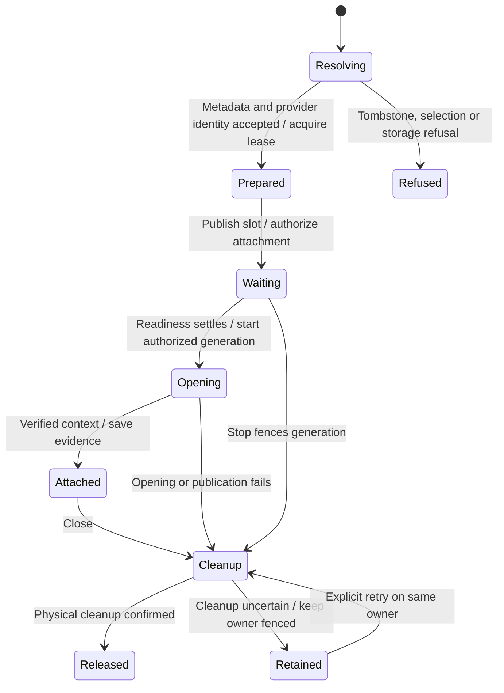
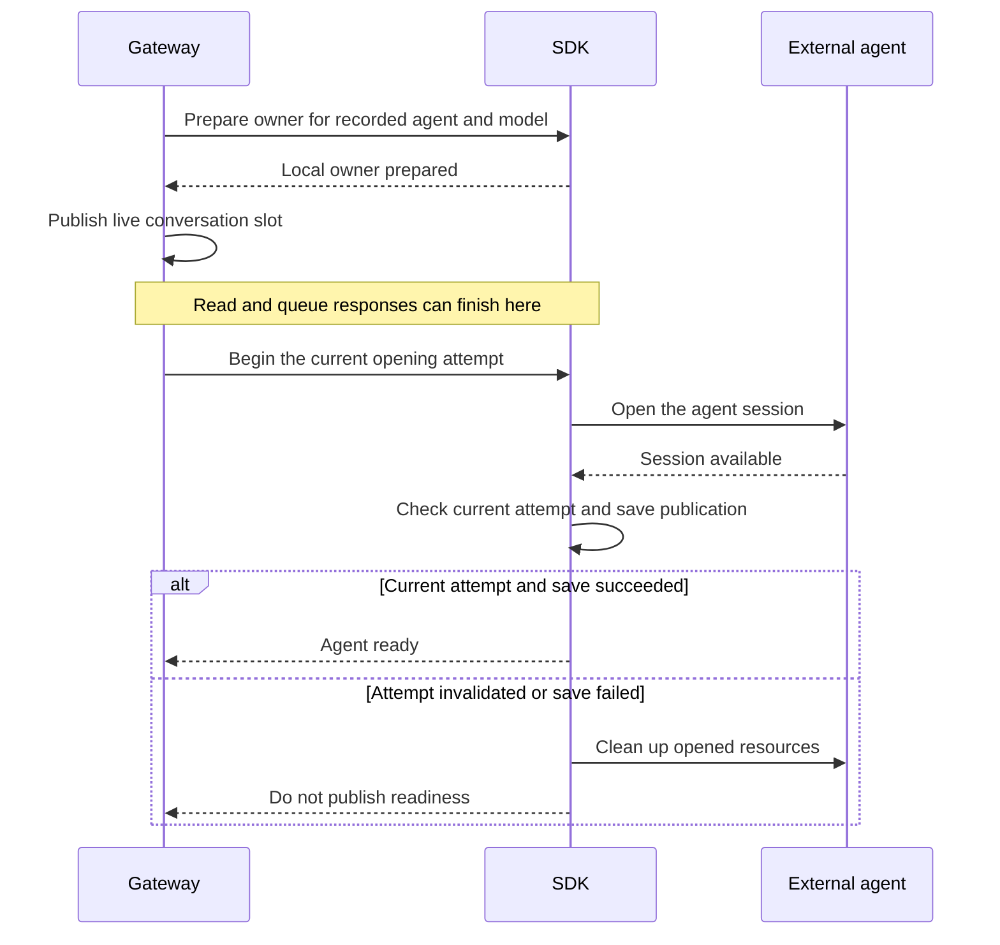

# a conversation opens its selected provider

A conversation remembers the agent and model selected when it was created. Nessa prepares its local owner, then opens the external agent in a separate startup task.

Create, read and queue responses can finish before the agent is ready. The SDK keeps accepted inputs waiting during this time. Readiness requires the current opening attempt and its saved publication evidence; a late result from an invalidated attempt cannot replace it.

## From preparation to ready

## Further reading

[Source](../../../../../crates/nessa-server/src/conversation/application/service.rs) · [Related source](../../../../../crates/nessa-server/src/composition/current_agent.rs) · [Related tests](../../../../../crates/nessa-sdk/tests/application/agent_execution/agents/initialization/startup_control.rs)
