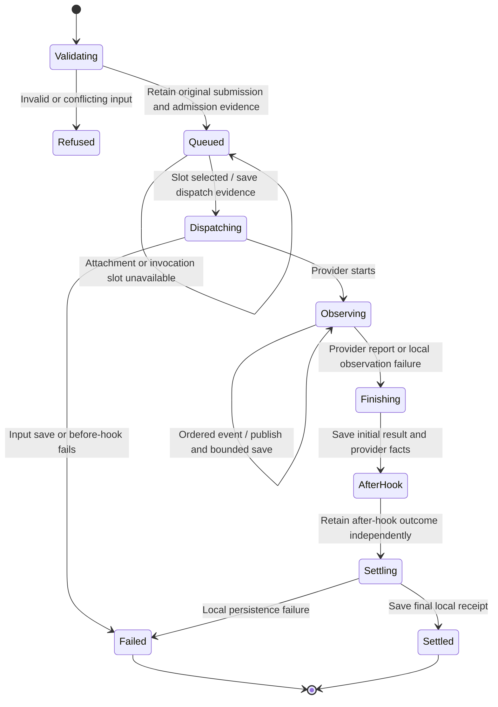

# an admitted message streams through the SDK and settles

An accepted message waits for its agent and execution slot. When it starts, the SDK forwards the input, publishes ordered output and records the result.

Acceptance, agent completion and a saved local result are different moments. The agent can finish while a later local save fails. An empty stream or closed connection does not prove success. Recovery keeps the original submission identity and never replays a possibly delivered input just because its reply is missing.

## Further reading

[Source](../../../../../crates/nessa-sdk/src/application/agent_execution/agents/agent.rs) · [Related source](../../../../../crates/nessa-sdk/src/application/agent_execution/agents/scheduling.rs) · [Related tests](../../../../../crates/nessa-sdk/tests/application/agent_execution/scheduling/retries.rs)
