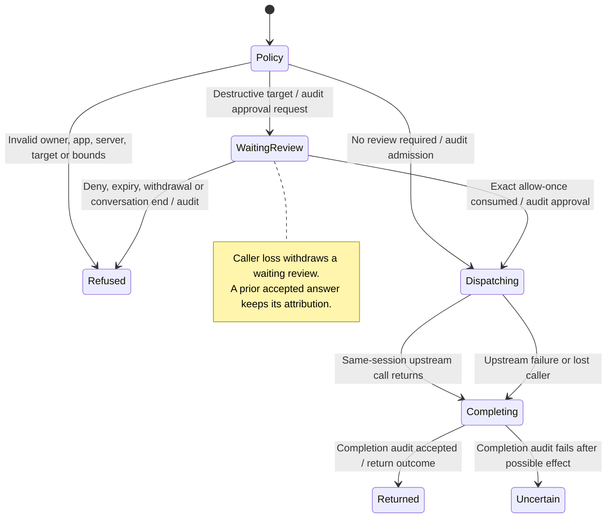

# an app calls a tool through gateway policy and review

An app can ask the gateway to call a tool on its originating server. The gateway checks the conversation, originating tool, app visibility and request before sending anything. Destructive tools require an app-specific approval even if the conversation uses a different approval preset.

Approval expires after five minutes and applies only to the matching request. Completion audit is separate from the tool result. A tool can return an error as its answer. A lost answer after dispatch is uncertain, so the app must not automatically repeat the call. Gateway-backed desktop apps call through their workspace client; sample-mode apps use fixtures.

## Further reading

[Source](../../../../../crates/nessa-server/src/product/mcp_apps.rs) · [Related source](../../../../../crates/nessa-server/src/conversation/application/service/app_calls.rs) · [Related tests](../../../../../crates/nessa-server/tests/conversation/app_calls.rs)
