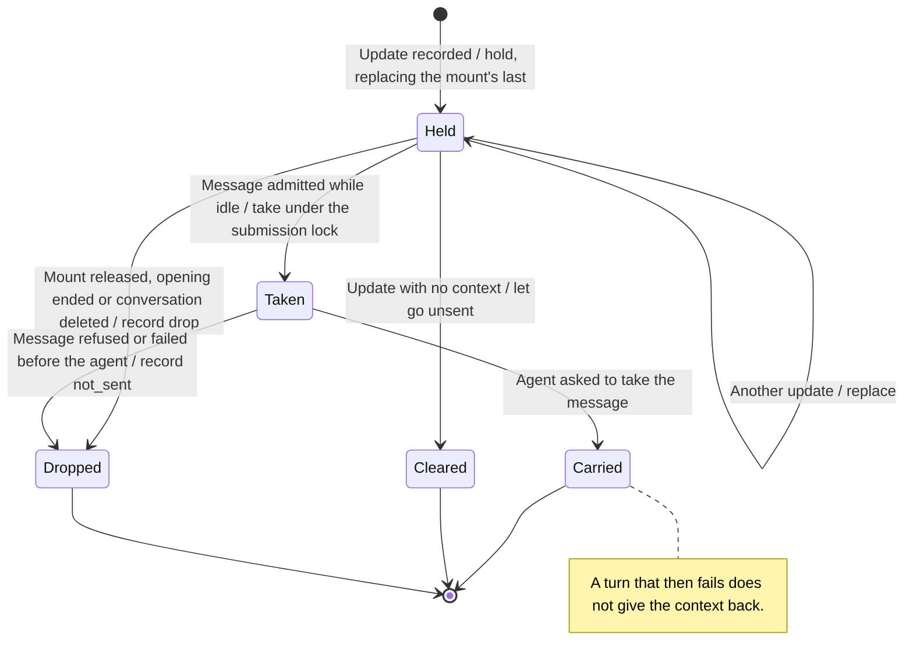

# an app sends a message and gives the model context

An app can send a message into its conversation with `mcp.sendMessage`. The message is the person's turn, written by the app, and the saved invocation names the app. Every message waits for the person to allow it in its own app review. The one exception is a retry of a turn the agent already has. While a turn runs or input waits, the message is refused with `turn_running`. Its text is held to the same bound as the person's own message.

An app can also give the model context with `mcp.updateModelContext`. The gateway holds one context per mount, and at most four mounts. Each context's text and structured content are each at most 8 KiB, past which the update is `invalid_request`, and together at most `AppModelContext::MAX_BYTES` (8 KiB), past which it is `mcp_request_too_large`. One update per conversation runs at a time, and each is recorded before it is held. The next message admitted while nothing runs or waits takes every held context and carries them as one leading text block. A queued or steered message takes none.

The gateway answers both methods as described here. The product client sends them as `client.mcpApps.sendMessage` and `client.mcpApps.updateModelContext`, refusing a request outside the schema's bounds before anything is sent.

The desktop window sends them for an app's `ui/message` and `ui/update-model-context`. It joins the app's text blocks into one text, and an update with no text and no structured content clears the mount's context. One mount's updates go one at a time, in the order the app gave them. While a message waits on its review, the window reads the conversation each round, so the person sees the card. The card says the app wants to send a message as you, because the review's `ask` is `message`. Once allowed, the message shows labelled with the app that wrote it. When the app's view ends, its mount is released, which withdraws a message still in review and drops its context.

## Held context

A held context is sent at most once. It is dropped unsent when its mount is released, when the conversation's opening ends, or when the conversation is deleted. A drop is recorded as `released` or `conversation_ended`, by whoever caused it. A context taken by a message that is then refused, or that fails before the agent is asked, is recorded as `not_sent`, and the app may give it again. A context carried by a turn that later fails is not given back. The turn's own record says what became of it.

## Further reading

[Design](../../../../design/mcp-app-calls.md) · [Source](../../../../../crates/nessa-server/src/conversation/application/service/app_calls.rs) · [Related tests](../../../../../crates/nessa-server/tests/conversation/app_messages.rs) · [Desktop adapter](../../../../../src/desktop/widgets/app/adapters/gateway/app-messages.ts)
