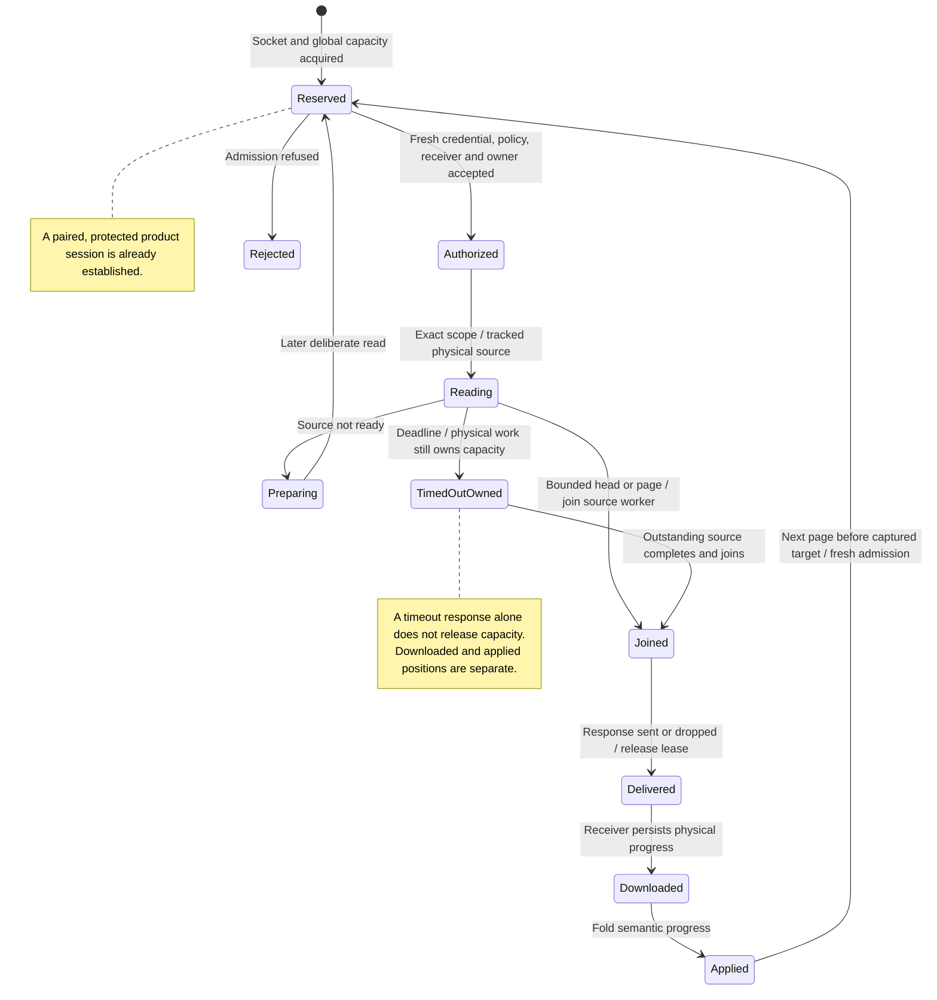

# an authorized receiver reads physical history without opening an agent

An authorized receiver can read saved records without opening an agent or running a prompt. It pages through a bounded history source and keeps its downloaded position.

Applying those records to its local view is a separate step with a separate checkpoint. The receiver pairs with the device and uses a protected native connection. It checks the pinned TLS identity, opens a product session and authenticates with its issued credential ID. Automatic device discovery and writable collaboration remain outside this read-only path. See [protected reads](../../../../design/auth/device-pairing.md#protected-reads-over-the-native-channel-slice-3). Source cleanup and response delivery must settle before the read capacity is reused.

## Further reading

[Source](../../../../../crates/nessa-server/src/conversation/application/passive_read.rs) · [Related source](../../../../../crates/nessa-server/src/conversation/application/record_read/read.rs) · [Related tests](../../../../../crates/nessa-server/tests/conversation/passive_read.rs)
