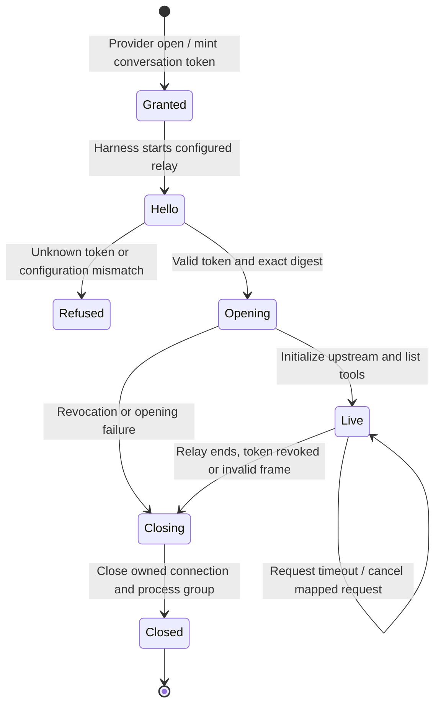

# an MCP tool shares its upstream session with its app

The agent's tool calls and an app from that tool share the conversation's connection to the configured server. A local relay carries the current opening's access grant.

Tool input cannot choose another executable or server. A fresh agent opening gets a fresh grant; an old grant cannot become permanent access. Gateway-backed desktop apps use that routing through their workspace client. Sample-mode apps use fixtures.

## Further reading

[Source](../../../../../crates/nessa-server/src/composition/mcp_servers.rs) · [Related source](../../../../../crates/nessa-server/src/mcp_servers/infrastructure/grants.rs) · [Related tests](../../../../../crates/nessa-server/tests/mcp_servers/mod.rs)
