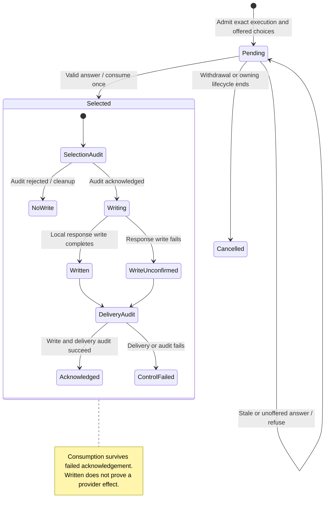

# approve, deny, withdraw, or answer an agent's review

An agent's review asks for an answer to a specific tool action in the current execution. Nessa shows the offered options and keeps the decision linked to the caller, original request and agent session.

Allow and deny both need audit evidence. Cancelling or withdrawing a request differs from answering it. Once a choice is consumed, a missing delivery reply cannot safely turn it back into a pending request. Gateway-owned app reviews are routed separately from SDK agent reviews.

## Further reading

[Source](../../../../../crates/nessa-sdk/src/application/agent_execution/permissions/answer.rs) · [Related source](../../../../../crates/nessa-sdk/src/application/agent_execution/permissions/approval.rs) · [Related tests](../../../../../crates/nessa-sdk/tests/infrastructure/acp/contracts/permissions/answers.rs)
