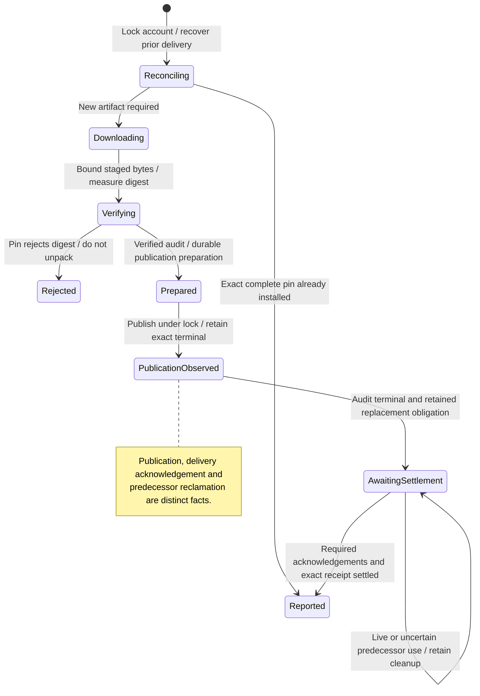

# install or replace a pinned agent runtime

Installation downloads and publishes the agent version Nessa has tested. Launch resolves the current installed version; an old printed path is not a promise that it remains safe to use.

Before spawning, Nessa records that the process owns a use of that version. Replacement cannot remove it until those uses are confirmed released. A dropped guard or process-exit message alone is insufficient. A file found after a crash does not invent missing proof that publication completed.

## Further reading

[Source](../../../../../crates/nessa-server/src/agent_install/application/install.rs) · [Related source](../../../../../crates/nessa-server/src/agent_install/domain/release_selection.rs) · [Related tests](../../../../../crates/nessa-server/tests/agent_install/install.rs)
