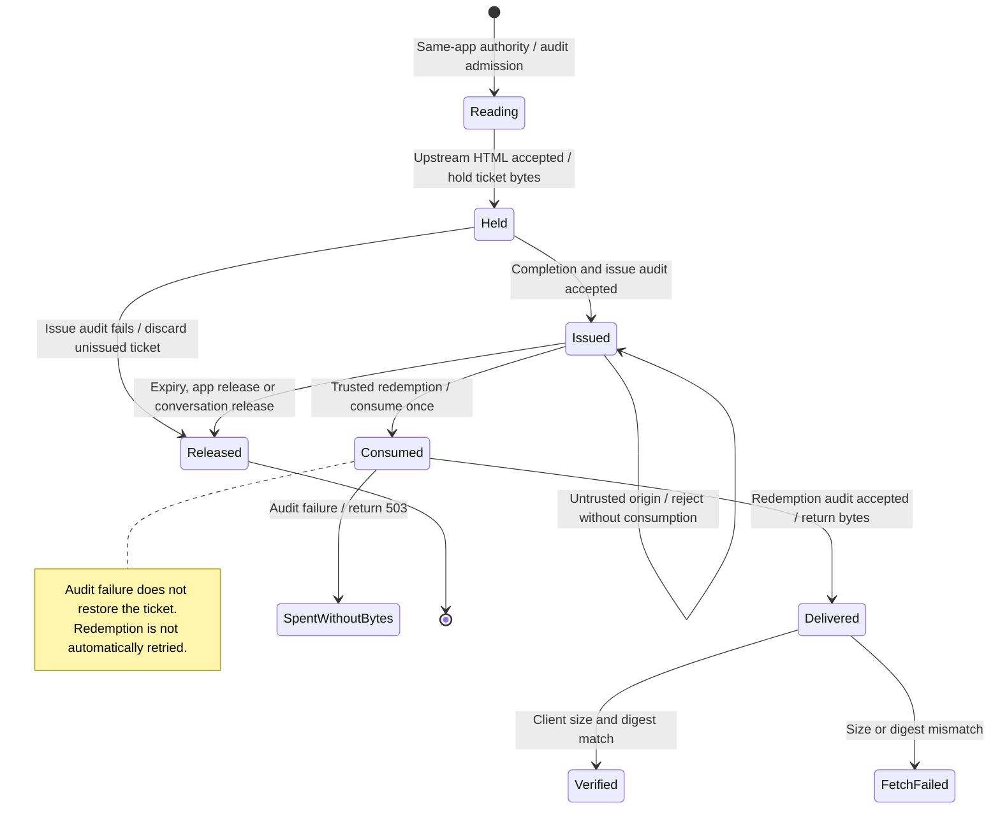

# read an app resource once and release its ticket

The gateway reads an app's HTML once and returns metadata with a single-use download ticket. The ticket lasts 60 seconds. The client checks the returned bytes against the expected length and digest.

Fetching consumes the ticket before audit and delivery finish. A failed or lost reply cannot be retried with the same ticket. Release or expiry frees held bytes separately from its audit result. Redemption currently has no separate audit deadline, so audit can delay the reply.

## Further reading

[Source](../../../../../crates/nessa-server/src/conversation/application/mcp_apps.rs) · [Related source](../../../../../crates/nessa-server/src/mcp_servers/infrastructure/resource_tickets.rs) · [Related tests](../../../../../crates/nessa-server/tests/mcp_servers/resource_tickets.rs)
