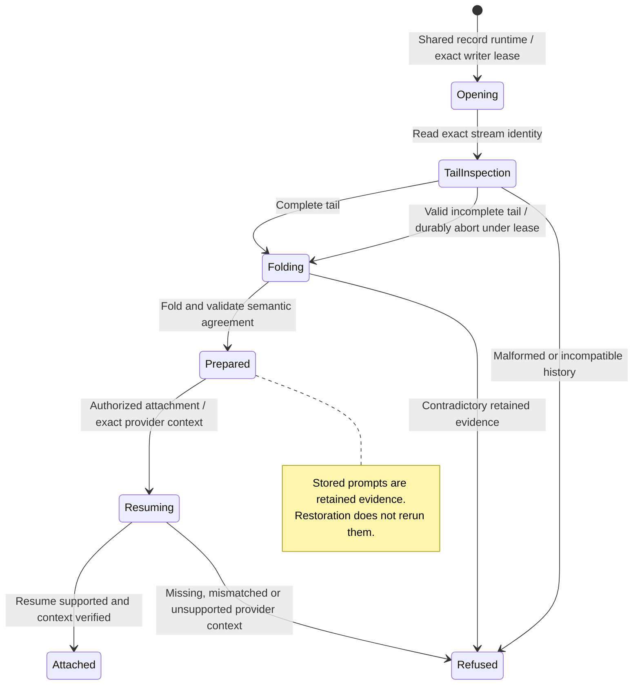

# restart and restore committed conversation history

Restart loads the saved conversation records and reconstructs the committed history. Live output that was never successfully saved is not recoverable from those records.

Saving batches messages and flushes at important boundaries such as reviews and results. Retry can confirm an already-written batch without adding it twice. Restoration validates the agent context and retained scheduling facts; it does not run old prompts again. Deleted identities remain blocked even while unfinished erasure is retried.

## Further reading

[Source](../../../../../crates/nessa-sdk/src/infrastructure/session_storage/record.rs) · [Related source](../../../../../crates/nessa-sdk/src/infrastructure/session_storage/record_writer.rs) · [Related tests](../../../../../crates/nessa-sdk/tests/infrastructure/session_storage.rs)
