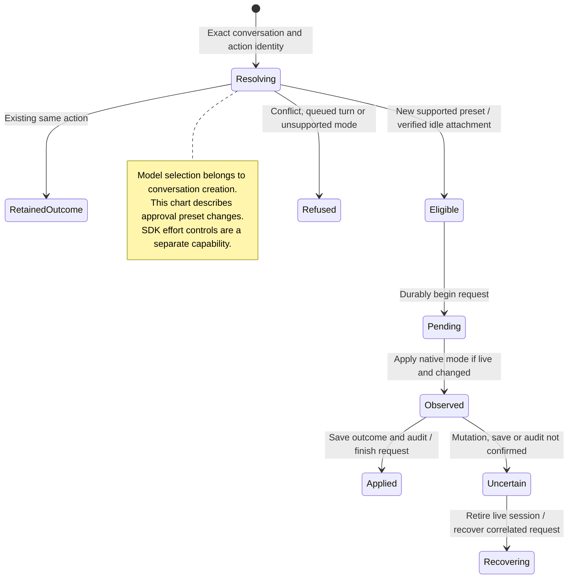

# select a model, approval preset, or reasoning effort

The model is chosen when the conversation is created and kept when it reopens. Choosing another model for a new conversation does not migrate an existing agent's context.

An idle conversation has a working approval-preset change path. The Rust SDK also supports verified reasoning-effort changes for supported agents, but that alone does not establish a product control. A requested change is separate from the agent confirming that it applied it.

## Further reading

[Source](../../../../../crates/nessa-server/src/conversation/application/service.rs) · [Related source](../../../../../crates/nessa-server/src/conversation/infrastructure/mode_audit.rs) · [Related tests](../../../../../crates/nessa-server/tests/conversation/application.rs)
