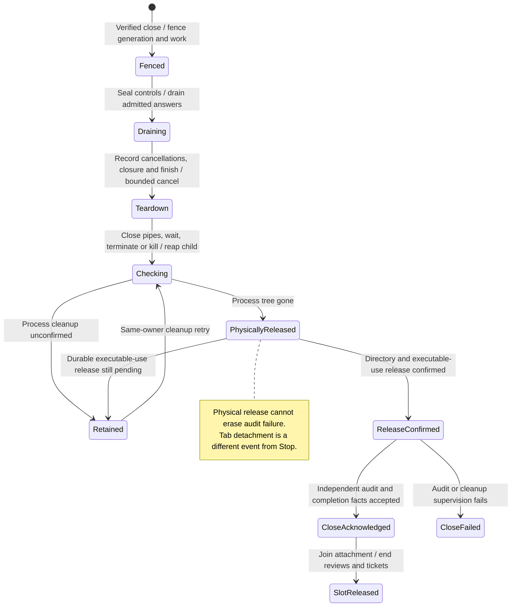

# Stop cancels owned work and confirms process cleanup

Stop blocks new work, cancels waiting or active inputs and closes the current agent connection. Saved history remains for later reopening. Archive only changes list visibility; closing a populated tab only detaches its view.

Physical process cleanup, release of installed-runtime use and audit delivery are separate results. A repeated close can retry unfinished cleanup. Delete additionally asks the provider to dispose of its session and erases Nessa-owned data. A provider may archive or retain its record, so local erasure must not be presented as proof that every external copy was deleted.

## Confirming the process group

`ProcessScope` closes the child's stdin, waits out `shutdown_grace`, then
`SIGTERM` and `SIGKILL`, each followed by at most `kill_timeout`. Those bounds
are real time. They are not what made macOS CI report `CleanupUncertain` on a
harness that had already answered and then exited on EOF: a cooperative exit
is reaped in well under `kill_timeout`, and `SIGKILL` does not wait for the
child to be scheduled. The shared fixture keeps `kill_timeout` at two seconds
because that wait is the escalation for a process that survives `SIGTERM`, not
a slack factor for a slow runner.

A `kill` or `waitpid` result is a verdict only when it says the group was
signalled or that it is gone (`ESRCH` after the leader is reaped). Anything
else keeps the same budget.

| Call | Result | Verdict | Next |
| --- | --- | --- | --- |
| `kill` | 0 | delivered | wait for `ESRCH` or the budget |
| `kill` | `ESRCH` | group already empty | reap; not a failure |
| `kill` | `EPERM` | no verdict (macOS: exiting or unreaped leader; otherwise a real refusal) | keep waiting; `CleanupUncertain` only if `ESRCH` never arrives |
| `kill` | `EINTR` | no verdict (macOS `kill(2)` when a caught signal interrupts the call) | retry, then the same as no verdict; not a failure |
| `kill` | anything else | cannot tell | `CleanupUncertain` |
| `waitpid` | exited or still running | observed | probe the group |
| `waitpid` | `EINTR` | no verdict | keep polling inside the same budget |
| `waitpid` | anything else | cannot tell | this phase is not confirmed |
| probe `kill(0)` | 0 | a member exists | keep polling |
| probe `kill(0)` | `ESRCH` | gone | confirmed |
| probe `kill(0)` | `EPERM`, `EINTR`, or anything else | no verdict | keep polling until the budget |

Held by `infrastructure::process::tests`: `an_interrupted_group_kill_retries_then_returns_the_verdict` (the injected signal: interrupt then absence, a refusal asked once, and sixteen interrupts), `an_interrupted_group_signal_is_not_a_cleanup_failure`, `a_group_probe_classifies_delivery_refusal_and_absence`, `an_interrupted_reap_keeps_the_same_cleanup_budget`, `signalling_an_exited_unreaped_group_is_not_a_cleanup_failure` (the macOS zombie), and `a_group_that_refuses_signals_is_never_confirmed_gone`.

## Linux container acceptance (#630)

Linux cleanup requires an init that reaps adopted descendants: use Docker
`--init`, or launch the owning process under `tini -s --`. A non-reaping PID 1
can retain a killed descendant as a zombie, so process-group absence remains
unconfirmed and private directories remain owned. The SDK does not enable a
process-global subreaper or treat a zombie as an absent group.

The opt-in [container harness](../../../../../scripts/process-cleanup/README.md)
uses the same explicitly selected SDK library test executable and fixture mounts
in four disposable PID namespaces. Its orderings are specified before the harness:

| Ordering | Required observation | Evidence test |
| --- | --- | --- |
| Directory test exits under non-reaping PID 1; inspect before PID 1 exits | One failed test, `CleanupUncertain`, new PPID-1 zombie, retained private directory | negative directory acceptance; missing-zombie and wrong-failure unit cases |
| ACP TERM-resistant parent creates child before `running`; close kills group; inspect after test exits | One failed test, `CleanupUncertain`, new PPID-1 zombie | negative ACP acceptance |
| Either test runs with Docker `--init`; init adopts and reaps descendants before inspection | One passing test, no new orphan zombie, no retained private directory | both positive acceptances; zero-test and positive-failure unit cases |
| Timeout, interrupt, validation or Docker failure during a scenario | Harness fails; diagnostics recorded before validation/removal; removal attempted independently of cancelled work | orchestration removal-on-interrupt, rejected-evidence and failure tests |

The harness supervisor waits only for its direct test process. Inspection occurs
while that supervisor remains alive; container removal then destroys the disposable
PID namespace, including its intentionally unreaped zombies.

## Further reading

[Source](../../../../../src/conversation/adapters/store/slice.ts) · [Related source](../../../../../crates/nessa-server/src/conversation/application/provider_sessions.rs) · [Related tests](../../../../../crates/nessa-sdk/tests/infrastructure/process.rs)
